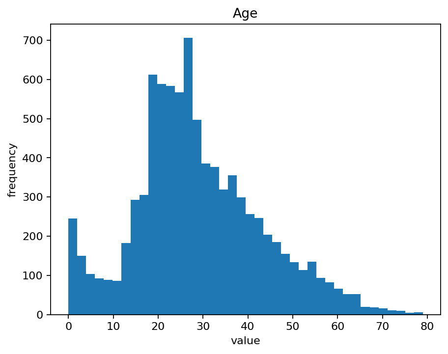
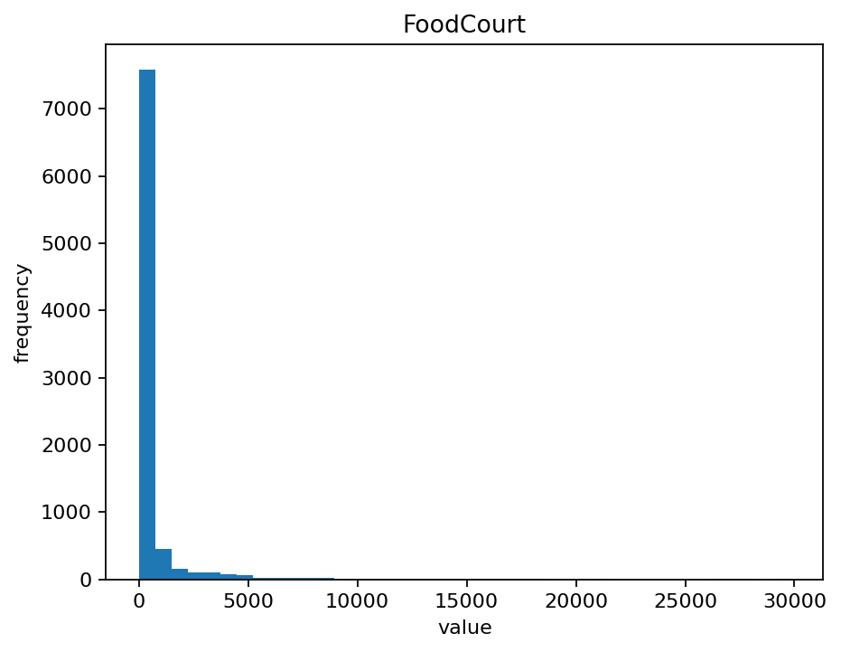
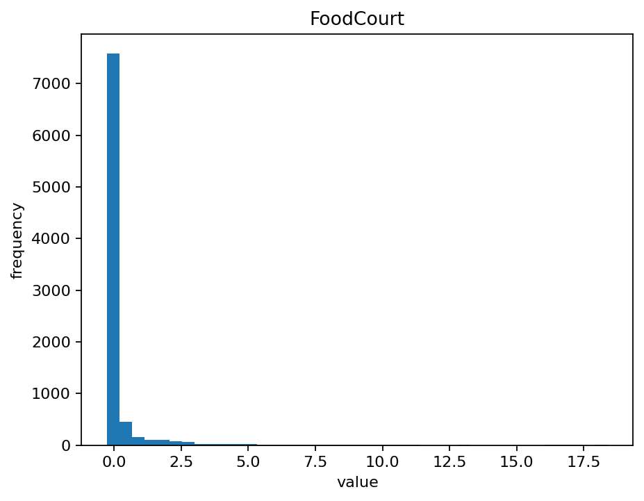

# Exercise 1

The source code for the exercise is available [here](https://github.com/thomaschiari/deep-learning-data-task).

## 1. Distribution & Overlap

- Class C0 is a compact cluster on the left, with vertical spread. 
- Class C1 is in the upper-middle region with larger variance, overlapping with C0.
- Class C2 is in the lower-middle and more compact, mostly separated from other classes.
- Class C3 is in the far right, tall and narrow, mostly without overlap. 

The only overlap is between C0 and C1. C2 and C3 are well separated from other classes. 

## 2. Can a single linear boundary separate all classes?

No, a single straight line can separate only in two regions, but we have four classes. Linear models can work ifwe use a multinomial logistic regression (in the image above), separating in four regions, but still struggle to separate C0 and C1. 

## 3. Neural network decision boundaries

A multi-layer perceptron (MLP) can better separate the boundaries between the classes than a linear model (see image above), bending around the classes and capturing the non-linear boundaries. 

# Exercise 2

## 1. Relationship between the classes

Looking at the projection (see image above), we see 2 main clusters: 
- Cluster A is in the left, with some variance in both axes. 
- Cluster B is in the right, with some variance in both axes. 
Both clusters overlap around the origin, so they are not perfectly separable in this projection. 

## 2. Linear separability

From the PCA scatter, we can observe that the separation between the classes is not perfectly linear. A boundary between the two clusters may split most points correctly, but the overlap around the origin makes it difficult to perfectly separate the classes.

Linear models struggle to separate the 2 classes because they are not able to capture non-linear boundaries. Neural networks with non-linear activation functions can learn non-linear boundaries, separating the classes with higher accuracy by adapting to different shapes of the data. 

# Exercise 3

## Dataset

Kaggle's "Spaceship Titanic" dataset is a binary classification dataset. The task is to predict whether a passenger was transported to an alternate dimension during the collision with the spacetime anomaly. For that, we have the following features:
- PassengerId: A unique identifier for each passenger.
- HomePlanet: The home planet of the passenger.
- CryoSleep: Indicates whether the passenger is in cryosleep for the voyage.
- Cabin: The cabin number of the passenger.
- Destination: The destination planet of the passenger.
- Age: The age of the passenger.
- VIP: Indicates whether the passenger is a VIP.
- RoomService, FoodCourt, ShoppingMall, Spa, VRDeck: amount the passenger has spent in the ship's services.
- Name: The name of the passenger.
- Transported: The target variable, indicating whether the passenger was transported to an alternate dimension.

Numerical features are: 
- Age
- RoomService
- FoodCourt
- ShoppingMall
- Spa
- VRDeck

Categorical features are:
- HomePlanet
- CryoSleep
- Cabin
- Destination
- VIP

The missing values are:
- PassengerId: 0
- HomePlanet: 201
- CryoSleep: 217
- Cabin: 199
- Destination: 182
- Age: 179
- VIP: 203
- RoomService: 181
- FoodCourt: 183
- ShoppingMall: 208
- Spa: 183
- VRDeck: 188
- Name: 200
- Transported: 0

We can see that the missing values are not random, but are concentrated in some features. We can impute the missing values with the median for numerical features and the most frequent value for categorical features.

## Preprocessing the data

- **Missing values**: the dataset has missing values in several numerical and categorical features. To prepare the data for a neural network, we can input the missing values:
    - Numerical features: input the missing values with the median of each column, which is robust against outliers. 
    - Categorical features: input the missing values wth the most frequent category (mode). This preserves the overall distribution without introducing unrealistic new labels. 

- **Encoding categorical features**: the categorical features cannot be directly interpreted by the neural network, so we can use one-hot encoding to transform each category into binary features. This avoids imposing an order on the categories. 

- **Scaling numerical features**: since the `tanh` activation function produces outputs between -1 and 1, we can scale numerical features using a standard scaler, which rescales data so each feature has a mean of 0 and a standard deviation of 1. This ensures that the features are distributed symetrically around 0. Alternatively, we could use a min-max scaler, scaling the features to a range between -1 and 1. 

## Visualization and scaling effects

### Age before and after scaling

### FoodCourt before and after scaling

- `Age` originally ranged from 0 to 90. After standardization, it is now centered at 0, but the distribution of the data remains the same. 
- This also happens with `FoodCourt`. The original data has many zeroes and multiple large values, and after scaling, the distribution remains the same, but the values are normalized relative to other features. 

---

*Note*: Artificial Intelligence was used in this exercise for code completion and review.

