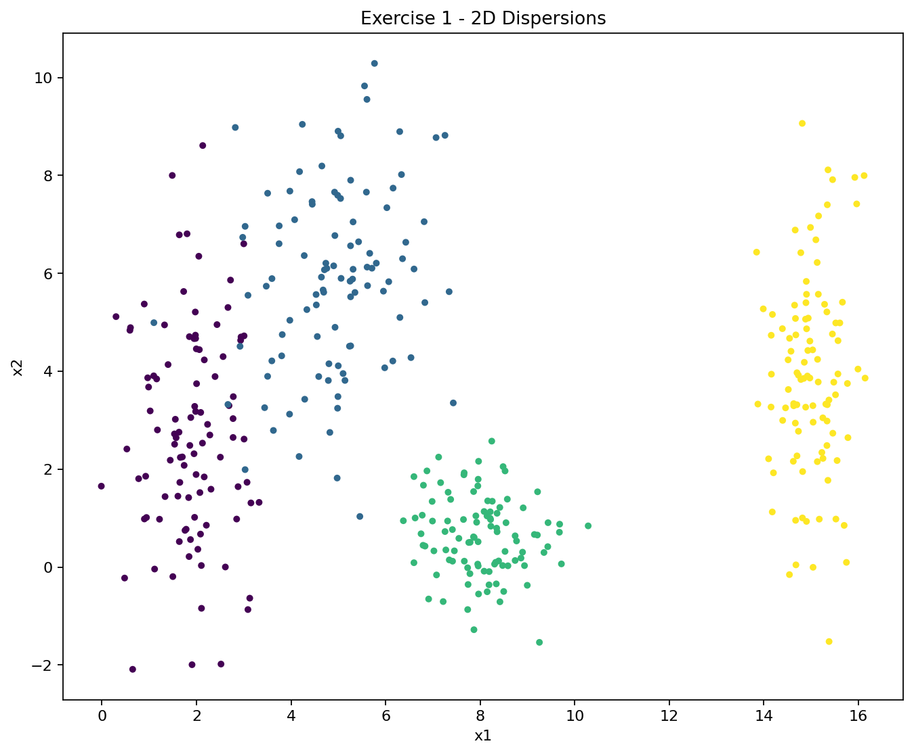
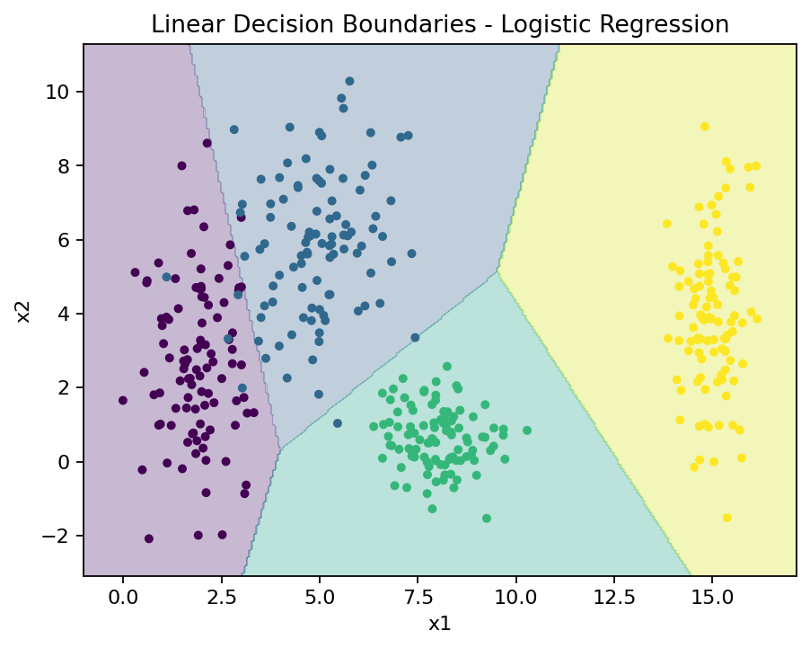
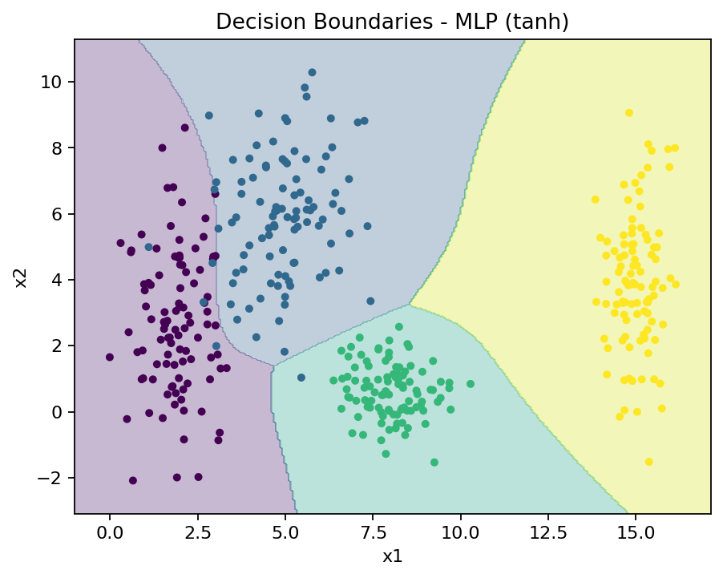
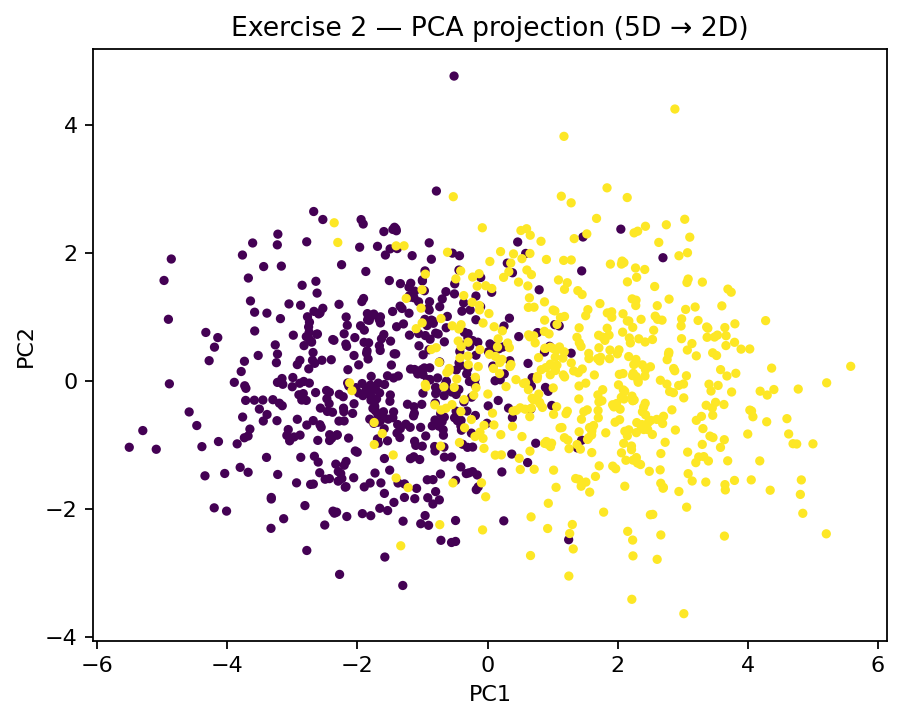

# Exercise 1

## 1. Distribution & Overlap

- Class C0 is a compact cluster on the left, with vertical spread. 
- Class C1 is in the upper-middle region with larger variance, overlapping with C0.
- Class C2 is in the lower-middle and more compact, mostly separated from other classes.
- Class C3 is in the far right, tall and narrow, mostly without overlap. 

The only overlap is between C0 and C1. C2 and C3 are well separated from other classes. 

## 2. Can a single linear boundary separate all classes?

No, a single straight line can separate only in two regions, but we have four classes. Linear models can work ifwe use a multinomial logistic regression (in the image above), separating in four regions, but still struggle to separate C0 and C1. 

## 3. Neural network decision boundaries

A multi-layer perceptron (MLP) can better separate the boundaries between the classes than a linear model (see image above), bending around the classes and capturing the non-linear boundaries. 

# Exercise 2

## 1. Relationship between the classes

Looking at the projection (see image above), we see 2 main clusters: 
- Cluster A is in the left, with some variance in both axes. 
- Cluster B is in the right, with some variance in both axes. 
Both clusters overlap around the origin, so they are not perfectly separable in this projection. 

## 2. Linear separability

From the PCA scatter, we can observe that the separation between the classes is not perfectly linear. A boundary between the two clusters may split most points correctly, but the overlap around the origin makes it difficult to perfectly separate the classes.

Linear models struggle to separate the 2 classes because they are not able to capture non-linear boundaries. Neural networks with non-linear activation functions can learn non-linear boundaries, separating the classes with higher accuracy by adapting to different shapes of the data. 