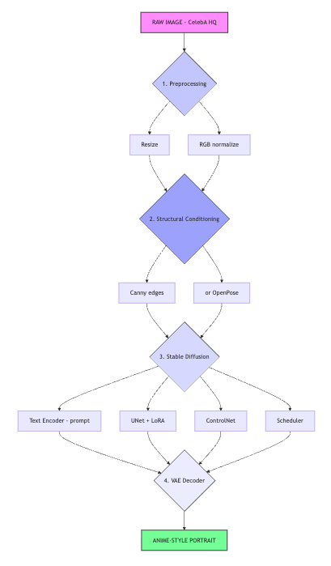

# Generative Project: Real-to-Anime - Portrait Stylization with Stable Diffusion, LoRA, and ControlNet

The complete source code for this project is available [here](https://github.com/thomaschiari/deep-learning-generative).

---

# **1 — Introduction**

This project implements a **Real-to-Anime Portrait Stylization Pipeline**, capable of transforming real images of human faces into stylized anime portraits.
The transformation is performed using an advanced **Image-to-Image Stable Diffusion pipeline**, enriched with **LoRA adapters** (for anime style transfer) and **ControlNet** (for structural conditioning such as Canny edges or OpenPose skeletal cues).

This task fits within the **Generative AI** theme of the course, which requires building a system utilizing **Stable Diffusion** to produce new content (images, videos, or text). Our system demonstrates:

* **Full pipeline construction**, not a template run
* **Model architecture explanation**
* **Use of advanced techniques (LoRA + ControlNet)**
* **5+ stylized outputs**
* **Metrics + qualitative evaluation**

---

# **2 — Theoretical Foundations**

## **2.1 Stable Diffusion (SD / SDXL)**

Stable Diffusion is a **Latent Diffusion Model (LDM)**. Instead of generating images directly, SD operates in a **compressed latent space** produced by a Variational Auto-Encoder (VAE).
The full architecture includes:

* **VAE**: Encodes an image into latent space; decodes latents back into pixels
* **CLIP Text Encoder**: Converts prompts into embedding vectors
* **U-Net Denoiser**: The core network that removes noise step-by-step
* **Scheduler**: Defines how noise is added and removed

In Image-to-Image mode, SD:

1. Encodes the input image into a latent representation
2. Adds a controlled amount of noise (controlled by `strength`)
3. Denoises conditioned on the text prompt (and optionally ControlNet)
4. Decodes back to an image

This allows *style transfer*, *identity preservation*, and *controlled variation*.

## **2.2 Turbo Models (SD-Turbo / SDXL-Turbo)**

Turbo models are **distilled versions** of SDXL and SD 1.5, trained to generate high-quality results using **fewer inference steps** (1–4 steps instead of 30–50).
They enable:

* Very fast inference
* Efficient batching
* Real-time stylization use cases

We use **SDXL-Turbo for Text-to-Image** and **SD-Turbo for Image-to-Image**.

---

## **2.3 LoRA (Low-Rank Adaptation)**

LoRA is a parameter-efficient fine-tuning method.
Instead of modifying all weights of a large model, LoRA inserts **low-rank matrices** inside attention blocks:

$$
[
W' = W + \Delta W = W + BA
]
$$

Where:

* $B$ and $A$ are low-rank matrices
* They represent a “style adapter” (e.g., anime style)

Advantages:

* Very small file sizes (~5–150 MB)
* You can load/unload LoRA at inference time
* Multiple LoRAs can be merged

This makes LoRA ideal for **anime style infusion**.

---

## **2.4 ControlNet**

ControlNet augments Stable Diffusion by adding an auxiliary branch that enforces **structural conditions**:

* **Canny ControlNet** → preserves edges and contour
* **OpenPose ControlNet** → preserves skeleton and pose

This ensures the output image:

* Maintains identity
* Preserves facial structure
* Follows pose
* Avoids drifting too far from input

This is why our outputs look like **anime versions of the same person**.

---

# **3 — Datasets and Models**

## **3.1 Datasets**

We use **CelebA-HQ** (test images only), which contains high-quality portrait images suitable for face stylization.
No training is performed; only inference is required.

## **3.2 Base Models**

| Component      | Model Used                     | Purpose                                  |
| -------------- | ------------------------------ | ---------------------------------------- |
| Text-to-Image  | SDXL-Turbo                     | Clean, high-detail anime base generation |
| Image-to-Image | SD-Turbo                       | Fast stylization from real portrait      |
| ControlNet     | Canny / OpenPose               | Structure preservation                   |
| LoRA Adapters  | AnimeDetailerXL, StyleEnhancer | Fine anime detailing                     |

---

# **4 — Architecture & Pipeline**

Below is an overview of the full system:

---

# **5 — Experiments**

We generate **≥5 stylized outputs**, varying:

* **LoRA scales**
* **ControlNet strengths**
* **Guidance scales**
* **Noise strength (I2I “creativity”)**
* **Model variant (Turbo / SDXL)**

**All images are saved to `assets/example_outputs/`.**

Example outputs (annotated):

1. Real → Anime (strong ControlNet, strong LoRA)
2. Real → Anime (weaker ControlNet)
3. Real → Soft render style
4. Real → Cel-shaded style
5. Real → Vibrant anime lighting

We also include a **grid comparison** for qualitative evaluation.

### Output/Input Examples
<table>
  <tr>
    <th>Input Image</th>
    <th>Output Image</th>
  </tr>
  <tr>
    <td></td>
    <td></td>
  </tr>
    <tr>
        <td></td>
        <td></td>
    </tr>
    <tr>
        <td></td>
        <td></td>
    </tr>
</table>

---

# **6 — Discussion**

### Strengths

* Identity preserved due to ControlNet
* High-quality anime texture thanks to LoRA
* Real-time inference with Turbo models
* Flexible stylization with prompt control

### Weaknesses

* Hands and accessories may distort
* Too much LoRA = over-stylization
* Too little ControlNet = structural drift

### Possible Extensions

* Add face alignment / cropping
* Use diffusion masks to stylize only selected regions
* Incorporate depth maps or segmentation ControlNets
* Animate results with frame-to-frame consistency

---

*Note*: Artificial Intelligence was used in this exercise for code completion and review, and for text revision.