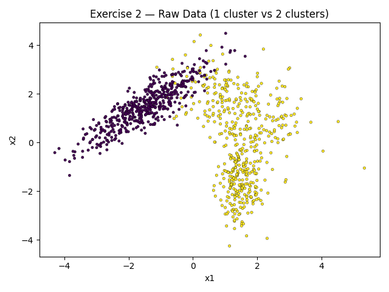
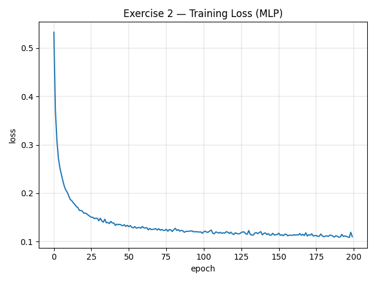
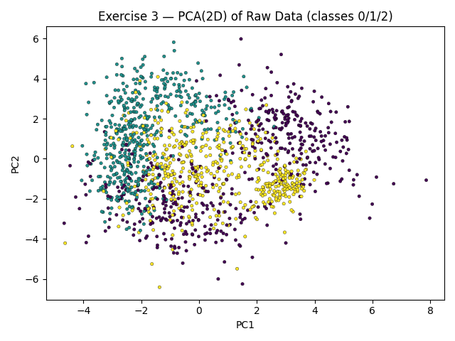
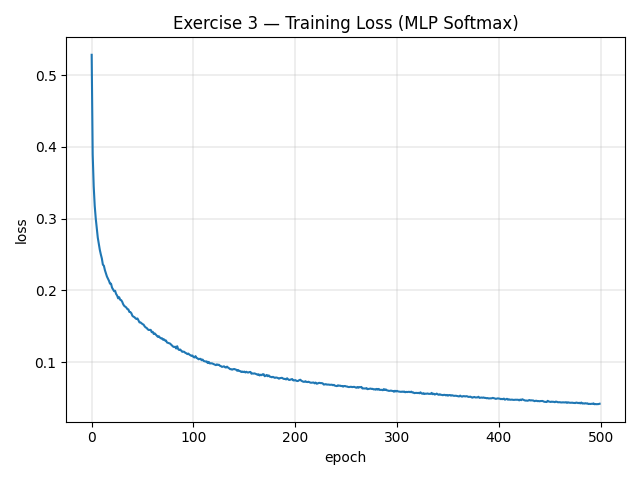
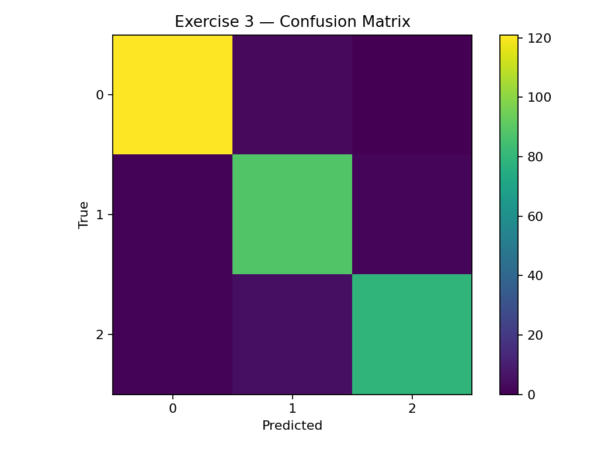
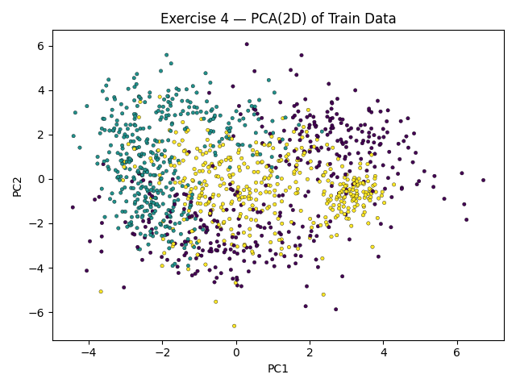
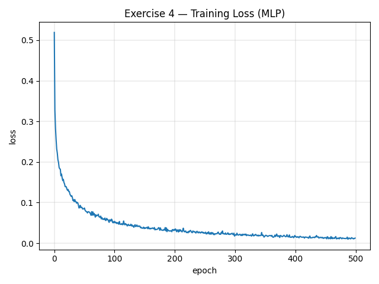
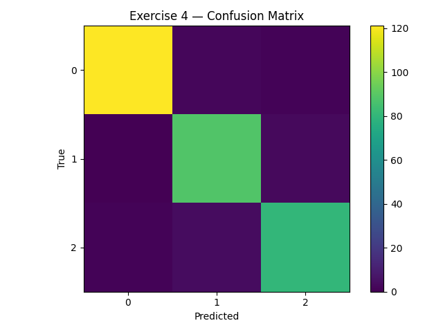

# MLP Task

The complete source code for this task is available [here](https://github.com/thomaschiari/deep-learning-mlp-task).

## Exercise 1 - Manual Calculation of MLP Steps

We consider a MLP with 2 features, 1 layer with 2 neurons, and 1 output neuron, with tanh activations and MSE loss $L=\frac{1}{N}(y-\hat y)^2$ ($N=1$). For the parameter update, use learning rate $\eta=0.1$.

**Given**

$$
\mathbf{x}=\begin{bmatrix}0.5\\-0.2\end{bmatrix},\quad
y=1.0,\quad
\mathbf{W}^{(1)}=\begin{bmatrix}0.3&-0.1\\0.2&0.4\end{bmatrix},\quad
\mathbf{b}^{(1)}=\begin{bmatrix}0.1\\-0.2\end{bmatrix},
$$

$$
\mathbf{W}^{(2)}=\begin{bmatrix}0.5&-0.3\end{bmatrix},\quad
b^{(2)}=0.2,\quad
\text{activation } \tanh(u),\quad
L=(y-\hat y)^2.
$$

### 1. Forward pass

**Hidden pre-activation**

$$
\mathbf{z}^{(1)}=\mathbf{W}^{(1)}\mathbf{x}+\mathbf{b}^{(1)}
=\begin{bmatrix}0.3&-0.1\\0.2&0.4\end{bmatrix}
\begin{bmatrix}0.5\\-0.2\end{bmatrix}
+\begin{bmatrix}0.1\\-0.2\end{bmatrix}
=\begin{bmatrix}0.27\\-0.18\end{bmatrix}.
$$

**Hidden activation**

$$
\mathbf{h}^{(1)}=\tanh(\mathbf{z}^{(1)})
=\begin{bmatrix}\tanh(0.27)\\ \tanh(-0.18)\end{bmatrix}
\approx
\begin{bmatrix}0.26362484\\-0.17808087\end{bmatrix}.
$$

**Output pre-activation**

$$
u^{(2)}=\mathbf{W}^{(2)}\mathbf{h}^{(1)}+b^{(2)}
=0.5\cdot 0.26362484+(-0.3)\cdot(-0.17808087)+0.2
\approx 0.3852366782.
$$

**Output activation and loss**

$$
\hat y=\tanh(u^{(2)})\approx \tanh(0.3852366782)\approx 0.3672465626,
$$

$$
L=(y-\hat y)^2=(1-0.3672465626)^2\approx 0.4003769125.
$$

### 2. Backward pass

Useful derivative:
$$
\frac{d}{du}\tanh(u)=1-\tanh^2(u).
$$

**From loss to output:**

$$
\frac{\partial L}{\partial \hat y}=2(\hat y-1)\approx -1.2655068747,
$$

$$
\frac{\partial \hat y}{\partial u^{(2)}}=1-\tanh^2(u^{(2)})=1-\hat y^2\approx 0.8651299622,
$$

$$
\frac{\partial L}{\partial u^{(2)}}=\frac{\partial L}{\partial \hat y}\cdot \frac{\partial \hat y}{\partial u^{(2)}}
\approx (-1.2655068747)\cdot 0.8651299622\approx -1.0948279147.
$$

**Output layer gradients:**

$$
\frac{\partial L}{\partial \mathbf{W}^{(2)}}=\frac{\partial L}{\partial u^{(2)}}\,(\mathbf{h}^{(1)})^\top
\approx
\begin{bmatrix}
-1.0948279147\cdot 0.26362484 &
-1.0948279147\cdot (-0.17808087)
\end{bmatrix}
\approx
\begin{bmatrix}-0.28862383 & 0.19496791\end{bmatrix},
$$

$$
\frac{\partial L}{\partial b^{(2)}}=\frac{\partial L}{\partial u^{(2)}}\approx -1.0948279147.
$$

**Backpropagated to hidden activation:**

$$
\frac{\partial L}{\partial \mathbf{h}^{(1)}}=
\left(\frac{\partial L}{\partial u^{(2)}}\right)(\mathbf{W}^{(2)})^\top
\approx -1.0948279147\cdot
\begin{bmatrix}0.5\\-0.3\end{bmatrix}
\approx
\begin{bmatrix}-0.54741396\\ 0.32844837\end{bmatrix}.
$$

**Hidden activation derivative:**

$$
1-\tanh^2(\mathbf{z}^{(1)})=
\begin{bmatrix}
1-\tanh^2(0.27)\\[2pt]
1-\tanh^2(-0.18)
\end{bmatrix}
\approx
\begin{bmatrix}
0.93050195\\
0.96828720
\end{bmatrix}.
$$

**Hidden pre-activation gradient:**

$$
\frac{\partial L}{\partial \mathbf{z}^{(1)}}=
\frac{\partial L}{\partial \mathbf{h}^{(1)}}\odot
\left(1-\tanh^2(\mathbf{z}^{(1)})\right)
\approx
\begin{bmatrix}-0.54741396\\ 0.32844837\end{bmatrix}\odot
\begin{bmatrix}0.93050195\\ 0.96828720\end{bmatrix}
\approx
\begin{bmatrix}-0.50936975\\ 0.31803236\end{bmatrix}.
$$

**Hidden layer parameter gradients:**

$$
\frac{\partial L}{\partial \mathbf{W}^{(1)}}=
\frac{\partial L}{\partial \mathbf{z}^{(1)}}\,\mathbf{x}^\top
=
\begin{bmatrix}-0.50936975\\ 0.31803236\end{bmatrix}
\begin{bmatrix}0.5 & -0.2\end{bmatrix}
\approx
\begin{bmatrix}
-0.25468488 & 0.10187395\\
\ \ 0.15901618 & -0.06360647
\end{bmatrix},
$$

$$
\frac{\partial L}{\partial \mathbf{b}^{(1)}}=\frac{\partial L}{\partial \mathbf{z}^{(1)}}
\approx
\begin{bmatrix}-0.50936975\\ 0.31803236\end{bmatrix}.
$$

### 3. Parameter update (gradient descent)

**Output layer:**

$$
\mathbf{W}^{(2)}\leftarrow \mathbf{W}^{(2)}-\eta\,\frac{\partial L}{\partial \mathbf{W}^{(2)}}
=
\begin{bmatrix}0.5&-0.3\end{bmatrix}
-0.1\begin{bmatrix}-0.28862383&0.19496791\end{bmatrix}
=
\begin{bmatrix}0.52886238&-0.31949679\end{bmatrix},
$$

$$
b^{(2)}\leftarrow b^{(2)}-\eta\,\frac{\partial L}{\partial b^{(2)}}
=0.2-0.1(-1.0948279147)\approx 0.3094827915.
$$

**Hidden layer:**
$$
\mathbf{W}^{(1)}\leftarrow \mathbf{W}^{(1)}-\eta\,\frac{\partial L}{\partial \mathbf{W}^{(1)}}
=
\begin{bmatrix}0.3&-0.1\\0.2&0.4\end{bmatrix}
-0.1
\begin{bmatrix}
-0.25468488 & 0.10187395\\
\ \ 0.15901618 & -0.06360647
\end{bmatrix}
\approx
\begin{bmatrix}
0.32546849 & -0.11018740\\
0.18409838 & \ \ 0.40636065
\end{bmatrix},
$$

$$
\mathbf{b}^{(1)}\leftarrow \mathbf{b}^{(1)}-\eta\,\frac{\partial L}{\partial \mathbf{b}^{(1)}} =
\begin{bmatrix}0.1\\-0.2\end{bmatrix}
-0.1\begin{bmatrix}-0.50936975\\ 0.31803236\end{bmatrix}
\approx
\begin{bmatrix}0.15093698\\-0.23180324\end{bmatrix}.
$$

### 4. Final parameters
- $\mathbf{W}^{(2)} \approx [\,0.52886238,\ -0.31949679\,]$

- $b^{(2)} \approx 0.3094827915$

- $\displaystyle \mathbf{W}^{(1)} \approx
\begin{bmatrix}
0.32546849 & -0.11018740\\
0.18409838 & \ \ 0.40636065
\end{bmatrix}$

- $\displaystyle \mathbf{b}^{(1)} \approx
\begin{bmatrix}0.15093698\\-0.23180324\end{bmatrix}$

## Exercise 2 — Binary Classification and MLP

We need to build a 2D binary dataset where class 0 has 1 cluster and class 1 has 2 clusters. We will use `make_classification` and compose the subsets to create this. After that, we will train a NumPy only MLP with 1 hidden tanh layer with 16 neurons, and 1 output neuron (sigmoid + BCE loss). 

### 1. Data generation

Here, we generate two datasets and keep only the slice we need from each, then stack and shuffle the data.

```py
def _take_class(X, y, cls, n_needed):
    Xc = X[y == cls]
    if Xc.shape[0] < n_needed:
        raise ValueError("Increase n_samples in generator")
    return Xc[:n_needed]

def binary_1v2_clusters(n_total=1000, random_state=42, class_sep=1.5):
    n0 = n1 = n_total // 2

    Xa, ya = make_classification(
        n_samples=3*n0, n_features=2, n_informative=2, n_redundant=0,
        n_classes=2, n_clusters_per_class=1, class_sep=class_sep,
        flip_y=0.0, random_state=random_state
    )
    X0 = _take_class(Xa, ya, cls=0, n_needed=n0)

    Xb, yb = make_classification(
        n_samples=3*n1, n_features=2, n_informative=2, n_redundant=0,
        n_classes=2, n_clusters_per_class=2, class_sep=class_sep,
        flip_y=0.0, random_state=random_state + 1
    )
    X1 = _take_class(Xb, yb, cls=1, n_needed=n1)

    X = np.vstack([X0, X1])
    y = np.hstack([np.zeros(n0, dtype=int), np.ones(n1, dtype=int)])

    idx = np.random.default_rng(random_state + 2).permutation(n_total)
    return X[idx], y[idx]

rng = set_all_seeds(42)
X, y = binary_1v2_clusters(n_total=1000, random_state=42, class_sep=1.5)

Xtr, Xte, ytr, yte = train_test_split(X, y, test_size=0.2, seed=7)
ytr_b = ytr.reshape(-1, 1)
```

We get this data distribution plot:



### 2. MLP implementation

We will implement a MLP with 1 hidden tanh layer with 16 neurons, and 1 output neuron (sigmoid + BCE loss). First, we implement the layer class:

```py
class Dense:
    def __init__(self, in_dim, out_dim, activation=None, seed=None):
        self.in_dim, self.out_dim = in_dim, out_dim
        rng = np.random.default_rng(seed)
        std = np.sqrt(1.0 / in_dim)
        self.W = rng.normal(scale=std, size=(in_dim, out_dim))
        self.b = np.zeros(out_dim)
        self.activation = activation
        self._cache = {}

    def _act(self, z):
        if self.activation is None:         
            return z
        if self.activation == "tanh":       
            return tanh(z)
        if self.activation == "sigmoid":    
            return sigmoid(z)
        raise ValueError(f"unknown activation {self.activation}")

    def _dact(self, z):
        if self.activation is None:         
            return np.ones_like(z)
        if self.activation == "tanh":       
            return dtanh(z)
        if self.activation == "sigmoid":
            s = sigmoid(z)
            return s*(1.0 - s)
        raise ValueError(f"unknown activation {self.activation}")

    def forward(self, X):
        Z = X @ self.W + self.b
        A = self._act(Z)
        self._cache["X"], self._cache["Z"], self._cache["A"] = X, Z, A
        return A

    def backward(self, dA, lr):
        X, Z, A = self._cache["X"], self._cache["Z"], self._cache["A"]
        dZ = dA * self._dact(Z)
        dW = X.T @ dZ / X.shape[0]
        db = dZ.mean(axis=0)
        dX = dZ @ self.W.T
        self.W -= lr * dW
        self.b -= lr * db
        return dX
```

Then, we implement the MLP class, that uses the layer class:

```py
class MLP:
    def __init__(self, layer_dims, hidden_activation="tanh", seed=None):
        self.layers = []
        rng = np.random.default_rng(seed)

        for i in range(len(layer_dims) - 1):
            act = hidden_activation if i < len(layer_dims) - 2 else "sigmoid"
            self.layers.append(
                Dense(layer_dims[i], layer_dims[i+1], activation=act,
                      seed=int(rng.integers(1 << 30)))
            )

    def forward(self, X):
        A = X
        for lyr in self.layers:
            A = lyr.forward(A)
        return A 

    def _bce_and_grad(self, A, y):
        eps = 1e-12
        A = np.clip(A, eps, 1.0 - eps)
        loss = -(y*np.log(A) + (1-y)*np.log(1-A)).mean()
        dZ = (A - y)
        return float(loss), dZ

    def fit(self, X, y, epochs=200, lr=1e-1, batch_size=64, seed=None, verbose=False):
        rng = np.random.default_rng(seed)
        n = X.shape[0]
        hist = {"loss": []}

        for ep in range(epochs):
            idx = rng.permutation(n)
            Xs, ys = X[idx], y[idx]
            ep_losses = []

            for i in range(0, n, batch_size):
                xb = Xs[i:i+batch_size]
                yb = ys[i:i+batch_size]
                A = self.forward(xb)
                loss, dZlast = self._bce_and_grad(A, yb)
                ep_losses.append(loss)

                dA = dZlast
                for lyr in reversed(self.layers):
                    dA = lyr.backward(dA, lr)

            hist["loss"].append(np.mean(ep_losses))
            if verbose and (ep+1) % 20 == 0:
                print(f"epoch {ep+1}: loss={hist['loss'][-1]:.4f}")
        return hist

    def predict(self, X):
        A = self.forward(X).ravel()
        return (A >= 0.5).astype(int)
```

### 3. Training and results

Finally, we train the MLP in the generated dataset with the following code:

```py
mlp = MLP(layer_dims=[2, 16, 1], hidden_activation="tanh", seed=7)
hist = mlp.fit(Xtr, ytr_b, epochs=200, lr=1e-1, batch_size=64, seed=0, verbose=True)
```

We get the following training loss plot:



In this test, we got a test accuracy of 0.9400.

The confusion matrix is:

$$
\begin{bmatrix}
107 & 4 \\
8 & 81
\end{bmatrix}
$$

## Exercise 3 — Multiclass classification with MLP

We need to build a multiclass dataset with 3 classes, 4 features, and 2, 3 and 4 clusters per class, respectively. We will use `make_classification` and compose the subsets to create this. After that, we will make slight changes to the Dense and MLP classes previously implemented, now supporting softmax and cross-entropy loss for multiclass classification. Finally, we will train the MLP.

### 1. Data generation

Here, we generate three datasets and keep only the slice we need from each, then stack and shuffle the data. Also, we perform a PCA to reduce the dimensionality to 2D for visualization.

```py
def _take_class(X, y, cls, n_needed):
    Xc = X[y == cls]
    if Xc.shape[0] < n_needed:
        raise ValueError("Increase n_samples; not enough points for requested slice.")
    return Xc[:n_needed]

def multiclass_2_3_4_clusters(n_total=1500, random_state=42, class_sep=1.5):
    n_per = n_total // 3

    Xa, ya = make_classification(
        n_samples=3*n_per, n_features=4, n_informative=4, n_redundant=0,
        n_classes=3, n_clusters_per_class=2, class_sep=class_sep,
        flip_y=0.0, random_state=random_state
    )
    X0 = _take_class(Xa, ya, cls=0, n_needed=n_per)

    Xb, yb = make_classification(
        n_samples=3*n_per, n_features=4, n_informative=4, n_redundant=0,
        n_classes=3, n_clusters_per_class=3, class_sep=class_sep,
        flip_y=0.0, random_state=random_state+1
    )
    X1 = _take_class(Xb, yb, cls=1, n_needed=n_per)

    Xc, yc = make_classification(
        n_samples=3*n_per, n_features=4, n_informative=4, n_redundant=0,
        n_classes=3, n_clusters_per_class=4, class_sep=class_sep,
        flip_y=0.0, random_state=random_state+2
    )
    X2 = _take_class(Xc, yc, cls=2, n_needed=n_per)

    X = np.vstack([X0, X1, X2])
    y = np.hstack([
        np.zeros(n_per, dtype=int),
        np.ones(n_per, dtype=int),
        2*np.ones(n_per, dtype=int),
    ])

    idx = np.random.default_rng(random_state+3).permutation(n_total)
    return X[idx], y[idx]

X, y = multiclass_2_3_4_clusters(n_total=1500, random_state=42, class_sep=1.6)

Xtr, Xte, ytr, yte = train_test_split(X, y, test_size=0.2, seed=7)
ytr_oh = one_hot(ytr, 3)

pca = PCA(n_components=2, random_state=7).fit(X)
X2 = pca.transform(X)
```

Here is the data distribution plot after the PCA:



### 2. MLP changes

We need to make slight changes to the Dense and MLP classes previously implemented, now supporting softmax and cross-entropy loss for multiclass classification. Here is the new Dense class, now supporting all the mentioned activations:

```py
def tanh(z):      
    return np.tanh(z)
def dtanh(z):     
    a = np.tanh(z)
    return 1.0 - a*a
def sigmoid(z):   
    return 1.0 / (1.0 + np.exp(-z))
def softmax(z):
    zmax = z.max(axis=1, keepdims=True)
    e = np.exp(z - zmax)
    return e / e.sum(axis=1, keepdims=True)

class Dense:
    def __init__(self, in_dim, out_dim, activation=None, seed=None):
        self.in_dim, self.out_dim = in_dim, out_dim
        rng = np.random.default_rng(seed)
        std = np.sqrt(1.0 / in_dim)
        self.W = rng.normal(scale=std, size=(in_dim, out_dim))
        self.b = np.zeros(out_dim)
        self.activation = activation
        self._cache = {}

    def _act(self, z):
        if self.activation is None:         
            return z
        if self.activation == "tanh":       
            return tanh(z)
        if self.activation == "sigmoid":    
            return sigmoid(z)
        if self.activation == "softmax":
            return softmax(z)
        raise ValueError(f"unknown activation {self.activation}")

    def _dact(self, z):
        if self.activation is None:         
            return np.ones_like(z)
        if self.activation == "tanh":       
            return dtanh(z)
        if self.activation == "sigmoid":
            s = sigmoid(z)
            return s*(1.0 - s)
        if self.activation == "softmax":
            return None
        raise ValueError(f"unknown activation {self.activation}")

    def forward(self, X):
        Z = X @ self.W + self.b
        A = self._act(Z)
        self._cache["X"], self._cache["Z"], self._cache["A"] = X, Z, A
        return A

    def backward(self, dA, lr):
        X, Z, A = self._cache["X"], self._cache["Z"], self._cache["A"]
        if self.activation == "softmax":
            dZ = dA
        else:
            dZ = dA * self._dact(Z)
        dW = X.T @ dZ / X.shape[0]
        db = dZ.mean(axis=0)
        dX = dZ @ self.W.T
        self.W -= lr * dW
        self.b -= lr * db
        return dX
```

And here is the new MLP class, now supporting softmax and cross-entropy loss for multiclass classification:

```py
class MLP:
    def __init__(self, layer_dims, hidden_activation="tanh", multiclass=True, seed=None):
        self.layers = []
        self.multiclass = multiclass
        rng = np.random.default_rng(seed)

        for i in range(len(layer_dims) - 1):
            act = hidden_activation if i < len(layer_dims) - 2 else ("softmax" if multiclass else None)
            self.layers.append(
                Dense(layer_dims[i], layer_dims[i+1], activation=act,
                      seed=int(rng.integers(1 << 30)))
            )

    def forward(self, X):
        A = X
        for lyr in self.layers:
            A = lyr.forward(A)
        return A

    def _softmax_ce_and_grad(self, P, Y_onehot):
        eps = 1e-12
        P = np.clip(P, eps, 1.0)
        loss = -(Y_onehot * np.log(P)).sum(axis=1).mean()
        dZ = (P - Y_onehot)
        return float(loss), dZ

    def fit(self, X, y_onehot, epochs=300, lr=1e-1, batch_size=64, seed=None, verbose=False):
        rng = np.random.default_rng(seed)
        n = X.shape[0]
        hist = {"loss": []}

        for ep in range(epochs):
            idx = rng.permutation(n)
            Xs, ys = X[idx], y_onehot[idx]
            ep_losses = []

            for i in range(0, n, batch_size):
                xb = Xs[i:i+batch_size]
                yb = ys[i:i+batch_size]

                P = self.forward(xb)        
                loss, dZlast = self._softmax_ce_and_grad(P, yb)
                ep_losses.append(loss)

                dA = dZlast
                for lyr in reversed(self.layers):
                    dA = lyr.backward(dA, lr)

            hist["loss"].append(np.mean(ep_losses))
            if verbose and (ep+1) % 25 == 0:
                print(f"epoch {ep+1:3d}: loss={hist['loss'][-1]:.4f}")
        return hist

    def predict(self, X):
        P = self.forward(X)
        return np.argmax(P, axis=1)
```

### 3. Training and results

Finally, we train the MLP in the generated dataset with the following code:

```py
mlp3 = MLP(layer_dims=[4, 32, 3], hidden_activation="tanh", multiclass=True, seed=7)
hist3 = mlp3.fit(Xtr, one_hot(ytr, 3), epochs=500, lr=1e-1, batch_size=64, seed=0, verbose=True)
```

We get the following training loss plot:



In this test with 500 epochs, we got a test accuracy of 0.9600.

The confusion matrix is:



## Exercise 4 — Deeper MLP on multiclass dataset

We will now use a generated multiclass dataset, with the same code and parameters as the previous exercise, but now with a deeper MLP. For this exercise, we will use a MLP with 3 hidden layers, with 64, 64 and 32 neurons, respectively, and tanh activations. We will skip the data preparation step as it is the same as the previous exercise. Here is the 2D PCA plot of the train data:



No changes are needed to the MLP class, as it is already supporting softmax and cross-entropy loss for multiclass classification, and multiple hidden layers with selectable number of neurons.

We train the MLP with the following code:

```py
mlp4 = MLP(layer_dims=[4, 64, 64, 32, 3], hidden_activation="tanh", multiclass=True, seed=11)
hist4 = mlp4.fit(Xtr, ytr_oh, epochs=500, lr=1e-1, batch_size=64, seed=0, verbose=True)
```

We get the following training loss plot:



In this test with 500 epochs, we got a test accuracy of 0.9633.

The confusion matrix is:



The deeper MLP with two hidden layers achieved slightly better accuracy compared to the single hidden layer MLP from Exercise 3. However, the improvement was modest, as the one hidden layer architecture already performed very well. This shows that for relatively simple synthetic tasks, increasing depth may not yield significant gains, though it can provide small improvements in stability and performance.

---

*Note*: Artificial intelligence was used in this exercise for code completion and review, for translating math formulas to Latex, and for text review.