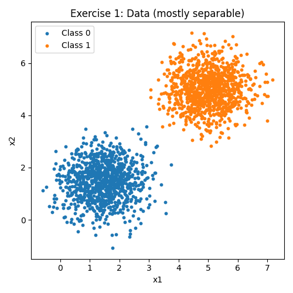
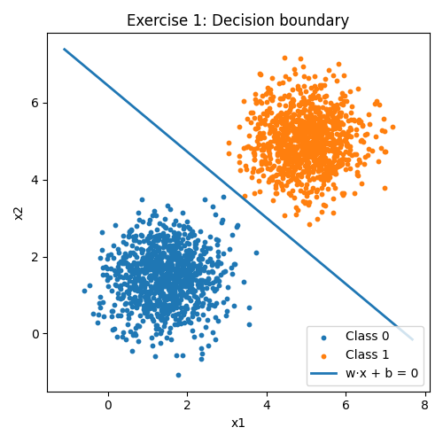
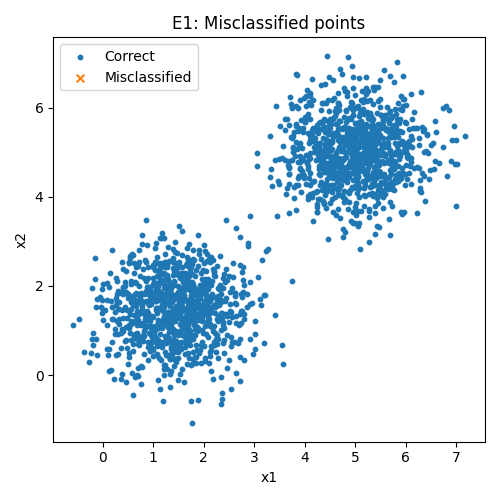
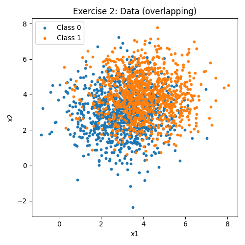
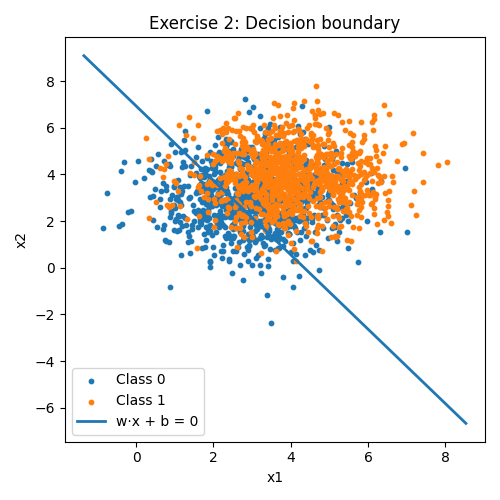
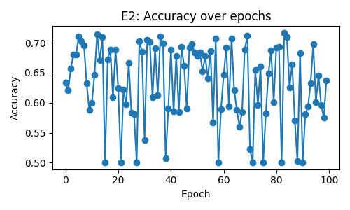
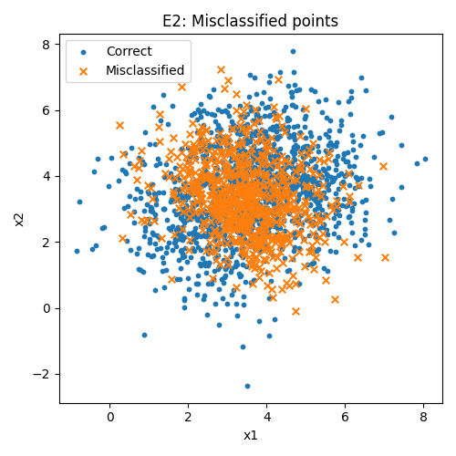

# Perceptron Task

The complete source code for this task is available [here](https://github.com/thomaschiari/deep-learning-perceptron-task).

## Exercise 1

### Data Generation

To begin with, a sample of 2D points from two multivariate normals (1000 samples per class) is generated:

- **Class 0:** mean = `[1.5, 1.5]`, covariance = `[[0.5, 0], [0, 0.5]]`

- **Class 1:** mean = `[5.0, 5.0]`, covariance = `[[0.5, 0], [0, 0.5]]`

Code Snippet:

```py
n_per_class = 1000

mean0 = np.array([1.5, 1.5])
cov0  = np.array([[0.5, 0.0], [0.0, 0.5]])

mean1 = np.array([5.0, 5.0])
cov1  = np.array([[0.5, 0.0], [0.0, 0.5]])

X0 = rng.multivariate_normal(mean0, cov0, size=n_per_class)
X1 = rng.multivariate_normal(mean1, cov1, size=n_per_class)
X  = np.vstack([X0, X1])
y01 = np.hstack([np.zeros(n_per_class, dtype=int), np.ones(n_per_class, dtype=int)])

plot_data(X, y01, title="Exercise 1: Data (mostly separable)", save_name="exercise1-data")
```

This creates two clusters that are mostly linearly separable.



### Single Layer Perceptron

After that, a single-layer perceptron is implemented from scratch using NumPy for linear algebra. The labels are mapped from `{0,1}` to `{-1,+1}`.

Code Snippet:

```py
class Perceptron:
    """
    Single layer perceptron implementation
    Update rule:
      w <- w + eta * y * x
      b <- b + eta * y
    Runs updates over epochs until no mistakes or max_epochs
    """
    def __init__(self, eta=0.01, max_epochs=100, shuffle=True, seed=None):
        self.eta = float(eta)
        self.max_epochs = int(max_epochs)
        self.shuffle = bool(shuffle)
        self.seed = seed
        self.w = None
        self.b = None
        self.history = {"epoch_acc": []}

    def _sign(self, z):
        # classify >=0 as +1 else -1
        return np.where(z >= 0, 1, -1)

    def fit(self, X, y_pm1):
        n, d = X.shape
        rng_local = np.random.default_rng(self.seed)

        # init small weights
        self.w = rng_local.normal(scale=0.01, size=d)
        self.b = 0.0

        for _ in range(self.max_epochs):
            if self.shuffle:
                idx = rng_local.permutation(n)
            else:
                idx = np.arange(n)

            updates = 0
            for i in idx:
                xi = X[i]
                yi = y_pm1[i]
                pred = self._sign(np.dot(self.w, xi) + self.b)
                if pred != yi:
                    self.w = self.w + self.eta * yi * xi
                    self.b = self.b + self.eta * yi
                    updates += 1

            y_pred = self.predict(X)
            acc = accuracy(y_pm1, y_pred)
            self.history["epoch_acc"].append(acc)

            if updates == 0:
                break

        return self

    def predict(self, X):
        z = X @ self.w + self.b
        return self._sign(z)
```

### Training & Results

Finally, the perceptron is trained for up to 100 epochs (early-stopping if no updates in an epoch).

Code Snippet:

```py
perc_e1 = Perceptron(eta=0.01, max_epochs=100, shuffle=True, seed=7)
perc_e1.fit(X, y_pm1)

y_pred_e1 = perc_e1.predict(X)
acc_e1 = accuracy(y_pm1, y_pred_e1)
```

With that, the final results obtained are:

- Final Accuracy: `1.0000`

- Final Weights: `[0.01332216 0.01551652]`

- Final Bias: `-0.09999999999999999`

### Decision Boundary

The decision boundary was plotted as follows:



Only one epoch was needed to achieve 100% accuracy, as the data is linearly separable. All points were correctly classified.



### Discussion

Because the two classes are linearly separable, with means far apart and low variance, the perceptron converges in very few passes with near perfect accuracy. This illustrates the Perceptron's theory: if the data is linearly separable, the aglorithm will find a separating hyperplane after a finite number of updates. In this case, the data is perfectly separable, so the perceptron converges in one epoch.

## Exercise 2

### Data Generation

First, 2D points were sampled (1000 samples per class):

- **Class 0:** mean = `[3.0, 3.0]`, covariance = `[[1.5, 0], [0, 1.5]]`

- **Class 1:** mean = `[4.0, 4.0]`, covariance = `[[1.5, 0], [0, 1.5]]`

Code Snippet:

```py
n_per_class = 1000

mean0 = np.array([3.0, 3.0])
cov0  = np.array([[1.5, 0.0], [0.0, 1.5]])

mean1 = np.array([4.0, 4.0])
cov1  = np.array([[1.5, 0.0], [0.0, 1.5]])

X0 = rng.multivariate_normal(mean0, cov0, size=n_per_class)
X1 = rng.multivariate_normal(mean1, cov1, size=n_per_class)
X2 = np.vstack([X0, X1])
y01_2 = np.hstack([np.zeros(n_per_class, dtype=int), np.ones(n_per_class, dtype=int)])

plot_data(X2, y01_2, title="Exercise 2: Data (overlapping)", save_name="exercise2-data")
```

This creates 2 clusters that are partially overlapping, so the data is not linearly separable.



### Perceptron

In order to train, we reuse the same class and training loop from Exercise 1.

### Training & Results

The perceptron is trained for up to 100 epochs (early-stopping if no updates in an epoch), using the same training loop as Exercise 1.

With that, the final results obtained were:

- Final Accuracy: `0.6375`

- Final Weights: `[0.09423536 0.05907569]`

- Final Bias: `-0.41000000000000014`

**Decision Boundary**



**Accuracy over epochs**



**Misclassified points**



### Discussion

Because the classes overlap, the perceptron cannot perfectly separate them, breaking the assumption of linear separability. As expected, the convergence did not occur within 100 epochs, continuing to make updates in each epoch. This happens because some samples are impossible to classify correctly with a single linear separator, so fixing one sample may cause another to be misclassified.

The accuracy of the perceptron ranged from 0.50 to 0.70 over the epochs, indicating that the perceptron was not able to converge to a perfect classifier. The comparison with Exercise 1 shows both the weakness and the strength of the perceptron. With perfectly separable data, it converges in one epoch (or few epochs), but with overlapping data it becomes unstable and unable to converge. 

---

*Note*: Artificial Intelligence was used in this exercise for code completion and review, and for text revision.