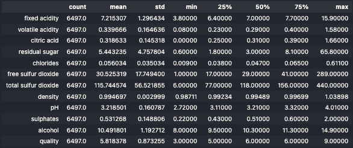
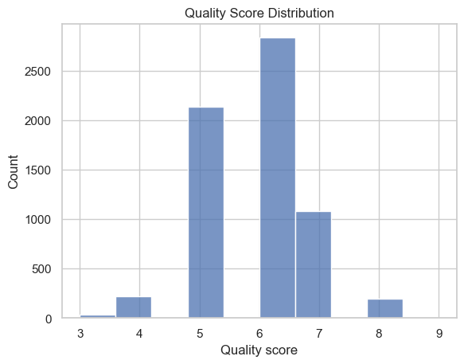
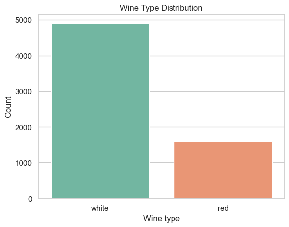
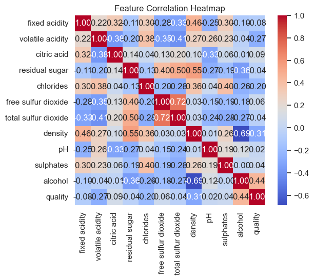
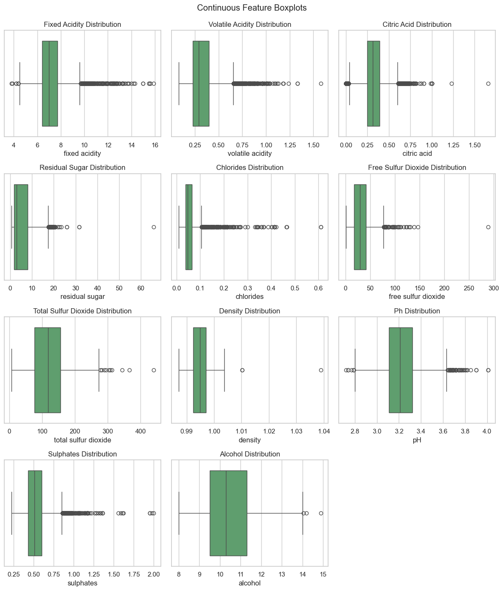
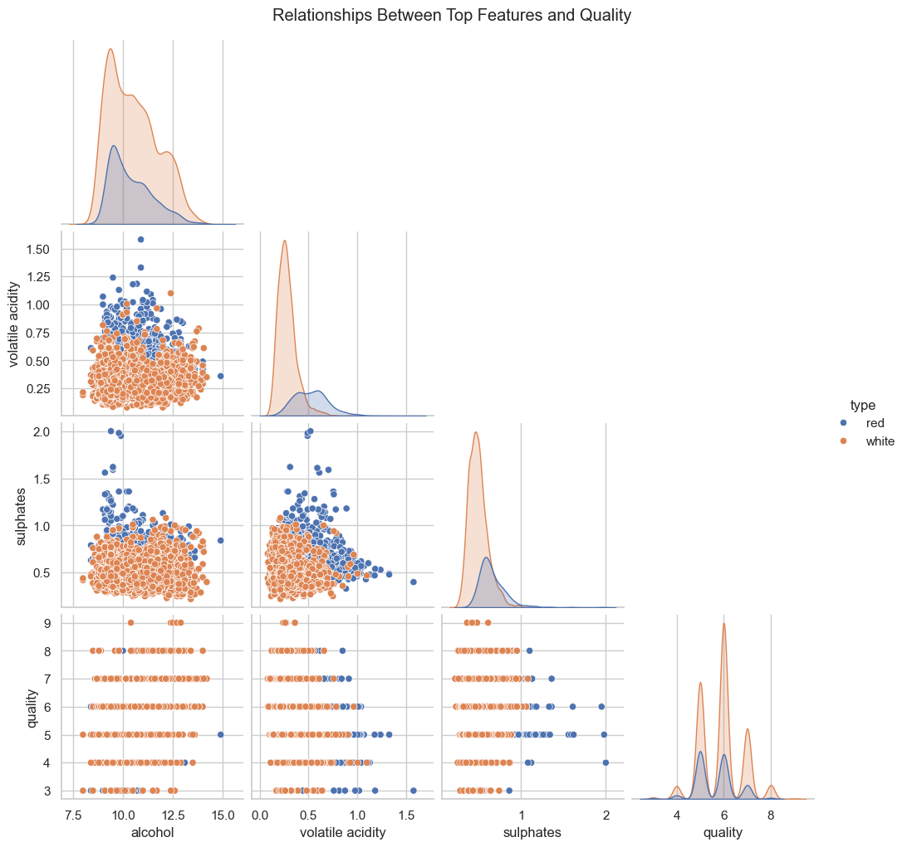
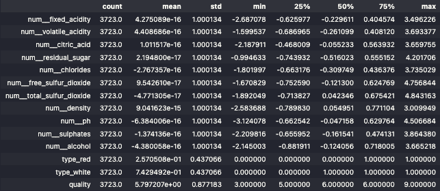

# Regression Project

The complete source code for this project is available [here](https://github.com/thomaschiari/deep-learning-regression-project).

## 1. Dataset Selecion

**Name**: Wine Quality Dataset

**Source**: UCI Machine Learning Repository [available here](https://archive.ics.uci.edu/dataset/186/wine+quality)

**Size**: 6497 rows and 11 features

**Task**: Regression. The target feature is a score between 1 and 10 for the quality of each wine, and is treated as a regression task in the UCI repository. 

**Why this dataset?** 

To begin with, all members of the group love wine. Moreover, the dataset is well-known, tabular, and does not include time-series features. It contains a mix of continuous features, and is divided into red wine and white wine, so we created a new categorical feature `type` to reflect that information and concatenated the two datasets. It relates to a real-world problem that the group is passionate about, which is predicting the quality of the wine based on mensurable lab features. The dataset also has no missing values. 

## 2. Dataset Explanation

**Description**: This dataset represents physicochemical laboratory tests performed on different wine samples. Each row corresponds to a wine sample, described by 11 numerical features such as acidity, sugar and pH, one categorical feature (created by us) indicating whether the wine is red or white, and one target feature representing the quality score assigned by human sensory evaluators. 

**Features**:

- Fixed Acidity: The amount of non-volatile acids in the wine, which affects its taste and stability.

- Volatile Acidity: The amount of acetic acid in the wine, which can lead to an unpleasant vinegar taste if too high.

- Citric Acid: A natural acid found in wine that can add freshness and flavor.

- Residual Sugar: The amount of sugar remaining in the wine after fermentation, which can influence sweetness.

- Chlorides: The amount of salt in the wine, which can affect its taste and preservation.

- Free Sulfur Dioxide: The amount of free SO2 in the wine, which acts as a preservative and antioxidant.

- Total Sulfur Dioxide: The total amount of SO2 in the wine, including both free and bound forms.

- Density: The density of the wine, which can indicate alcohol content and sugar levels.

- pH: The acidity level of the wine, which can affect its taste and stability.

- Sulphates: The amount of sulphates in the wine, which can contribute to its flavor and preservation.

- Alcohol: The alcohol content of the wine, which can influence its body and taste.

- Type: A categorical feature created by us indicating whether the wine is red or white.

**Target Feature**:

- Quality: A score between 1 and 10 assigned by human sensory evaluators, representing the overall quality of the wine. Though integer valued, it is modeled as continuous, as differences between values represent intensity variation (ordinal regression setup, but treated here as standard numeric regression).

**Dataset Numerical Summary**:



The summary of numerical features show that most features have varying scales and distributions, with very low values like density and chlorides, and very high values like total sulfur dioxide. Moreover, some features like residual sugar, total sulfur dioxide, and free sulfur dioxide exhibit right-skewed distributions, indicating that a small number of samples have significantly higher values compared to the rest. This suggests that feature scaling and potential transformations may be necessary during preprocessing to ensure effective model training.

The dataset contains 4898 samples of white wine and 1599 samples of red wine, indicating a class imbalance that may need to be addressed. 

**Visualizations**:

The following visualizations provide insights into the dataset's characteristics:

- Histogram of Quality Scores:

  

  The histogram shows that most wines have quality scores between 5 and 7, with fewer samples at the extreme ends of the scale. This indicates a moderate distribution of quality ratings.

- Type Distribution:

    
    
    The bar chart illustrates the class imbalance between red and white wines, with white wines being more prevalent in the dataset.

- Correlation Heatmap:

    
    
    The heatmap reveals the correlations between different features and the target variable (quality). Notably, alcohol content shows a positive correlation with quality, while volatile acidity exhibits a negative correlation, but no strong linear relationships are evident.

- Boxplots of Continuous Features:

    
    
    The boxplots highlight the distribution and potential outliers in each continuous feature, indicating variability in the data. Most continuous features show a large number of outliers, which will be addressed during preprocessing.

- Relationships Between Top Features and Quality:

    
    
    The pairplot illustrates the relationships between the top correlated features and quality, revealing potential non-linear patterns that may be important for modeling, but nothing really stands out strongly.

## 3. Data Cleaning and Normalization

### Overview

The preprocessing stage focused on ensuring data consistency, proper scaling, and avoiding information leakage. Because all original features were numerical except for the created `type` feature, we applied different strategies for numerical and categorical features, with standardization and one-hot encoding applied only after fitting on the training data. Additionally, outliers in numerical features were addressed using a custom transformer that clips values based on the 1st and 99th percentiles from the training set.

### Data Cleaning

The loaded dataset does not include any missing values, so no imputation was necessary. Column names were standardized to lowercase snake_case for consistency. Here is how we handled the loading, concatenation and feature creation:

```py
red_wine = pd.read_csv('data/winequality-red.csv', sep=';')
red_wine['type'] = 'red'
white_wine = pd.read_csv('data/winequality-white.csv', sep=';')
white_wine['type'] = 'white'

data = pd.concat([red_wine, white_wine], ignore_index=True)
```

### Data Splitting

To preserve the distribution of the target variable, the dataset was divided using a stratified sampling, based on quantile bins of the quality scores. This ensures that low quality and high quality wines are proportionally represented in each subset. The data was split into training (70%), validation (15%), and test (15%) sets as follows:

```py
def stratified_split(y: pd.Series, n_bins: int = 10):
    return pd.qcut(y, q=min(n_bins, y.nunique()), duplicates="drop")

y_bins = stratified_split(df['quality'], n_bins=10)

train_df, test_df = train_test_split(
    df,
    test_size=0.15,
    random_state=RANDOM_SEED,
    stratify=y_bins,
)

y_bins_train = stratified_split(train_df['quality'], n_bins=10)

train_df, val_df = train_test_split(
    train_df,
    test_size=0.1765,
    random_state=RANDOM_SEED,
    stratify=y_bins_train,
)
```

### Outlier Treatment

Although the dataset is clean, several features exhibit long right tails. The clipping of outliers was performed using the interquartile range (IQR) method, calculated only in the training set to prevent information leakage. This operation ensures that extreme values do not dominate the scale of each feature, while preserving the overall distribution and shape. 

```py
class OutlierClipper(BaseEstimator, TransformerMixin):
    def __init__(self, factor: float = 3.0):
        self.factor = factor
        self.lower_ = None
        self.upper_ = None
        self.columns_ = None

    def fit(self, X, y=None):
        if isinstance(X, pd.DataFrame):
            self.columns_ = X.columns
            q1 = X.quantile(0.25)
            q3 = X.quantile(0.75)
        else:
            X = pd.DataFrame(X)
            self.columns_ = X.columns
            q1 = X.quantile(0.25)
            q3 = X.quantile(0.75)

        iqr = q3 - q1
        self.lower_ = q1 - self.factor * iqr
        self.upper_ = q3 + self.factor * iqr
        return self

    def transform(self, X):
        X_df = X if isinstance(X, pd.DataFrame) else pd.DataFrame(X, columns=self.columns_)
        X_clipped = X_df.clip(self.lower_, self.upper_, axis=1)
        return X_clipped.values
```

### Normalization and Encoding

The final preprocessing pipeline applied 2 separate transformations: 

* Numerical Features: outlier clipping (previously described) and standardization using z-score transformation, ensuring each feature has a mean of 0 and a standard deviation of 1.

* Categorical Features: one-hot encoding to convert the `type` feature into binary columns, allowing the model to interpret categorical data effectively.

The transformation was implemented using a Column Transformer with a numerical pipeline and a categorical pipeline, as follows:

```py
numeric_pipeline = Pipeline(steps=[
    ("clip", OutlierClipper(factor=3.0)),
    ("scale", StandardScaler(with_mean=True, with_std=True)),
])

categorical_pipeline = Pipeline(steps=[
    ("ohe", OneHotEncoder(handle_unknown="ignore", drop=None, sparse_output=False)),
])

preprocess = ColumnTransformer(
    transformers=[
        ("num", numeric_pipeline, numeric_cols),
        ("cat", categorical_pipeline, categorical_cols),
    ],
    remainder="drop",
)
```

The final processed datasets were saved as CSV files, and the preprocessing pipeline was serialized using `joblib` for future use.

### Summary

At the end of preprocessing, we obtained the following dataset sizes:

```Sizes -> X_train: (3723, 13), X_val: (799, 13), X_test: (798, 13)```

This indicates that the training set contains 3723 samples with 13 features (after one-hot encoding), while the validation and test sets contain 799 and 798 samples respectively.

The summary statistics of the processed training dataset are as follows:



As we can see, the numerical features have been standardized to have a mean of approximately 0 and a standard deviation of approximately 1, which reduced the impact of outliers and differences in scale, while the categorical features have been one-hot encoded. The target variable `quality` remains unchanged.

## 4. MLP Implementation

### Overview

For the project, a Multilayer Perceptron model was implemented from scratch using only Numpy, without relying on deep learning frameworks. The goal was to understand and control every stage of the computation, from initialization of weights and the forward pass to gradient computation, backpropagation and optimization. The neural network predicts the continuous wine quality score based on the processed features.

### Model Architecture

The chosen architecture consists of:

- Input layer: 13 input features (after preprocessing)

- Hidden layers: 2 hidden layers with 128 and 64 neurons respectively, using ReLU or tanh activation functions to introduce non-linearity.

- Output layer: 1 neuron with a linear function to produce continuous output for regression.

The final layer does not apply an activation function, as regression tasks require unrestricted continuous outputs.

### Activation Functions

The network supports ReLU, tanh and sigmoid activations, implemented directly in Numpy:

```py
def act_forward(z, kind: str):
    if kind == "relu":   
        return np.maximum(0.0, z)
    if kind == "tanh":   
        return np.tanh(z)
    if kind == "sigmoid":
        return 1.0 / (1.0 + np.exp(-z))
    raise ValueError("activation must be relu/tanh/sigmoid")

def act_backward(z, a, kind: str):
    if kind == "relu":   
        return (z > 0).astype(z.dtype)
    if kind == "tanh":   
        return 1.0 - a*a
    if kind == "sigmoid":
        return a * (1.0 - a)
    raise ValueError("activation must be relu/tanh/sigmoid")

def parse_hidden(s: str) -> list[int]:
    return [int(x) for x in s.split(",")] if s else [64]
```

ReLU was selected as the default because of its empirical stability and faster convergence, but the other functions are available as arguments in the model constructor.

### Loss Functions and Metrics

3 loss functions were implemented for regression:

- Mean Squared Error (MSE): standard loss for regression tasks

- Mean Absolute Error (MAE): robust to outliers

- Root Mean Squared Error (RMSE): interpretable in the same units as the target variable

- R2 Score: statistical measure of how well the predictions approximate the actual values

```py
def mae(y_true, y_pred):
    return float(np.mean(np.abs(y_pred - y_true)))

def mse(y_true, y_pred):
    return float(np.mean((y_pred - y_true)**2))

def rmse(y_true, y_pred):
    return float(np.sqrt(mse(y_true, y_pred)))

def r2_score(y_true, y_pred):
    ss_res = np.sum((y_true - y_pred)**2)
    ss_tot = np.sum((y_true - y_true.mean())**2)
    return float(1.0 - ss_res / (ss_tot + 1e-12))
```

### Backpropagation

Gradients for all layers were computed manually using the chain rule. The derivative of each activation function was implemented in the `act_backward` function. 

```py
def backward(self, grad_out, caches):
    """
    Backprop gradients from grad_out (= dL/dA_L, shape (N,1))
    Returns lists dW, db
    """
    L = len(self.W)
    dZ = grad_out
    dW_list, db_list = [None]*L, [None]*L

    for l in reversed(range(L)):
        A_prev, Z, A = caches[l]
        dW = A_prev.T @ dZ + self.l2 * self.W[l]
        db = np.sum(dZ, axis=0, keepdims=True)

        dW_list[l] = dW.astype(np.float32)
        db_list[l] = db.astype(np.float32)

        if l > 0:
            dA_prev = dZ @ self.W[l].T
            A_prev_prev, Z_prev, A_prev_post = caches[l-1]
            dZ = dA_prev * act_backward(Z_prev, A_prev_post, self.activation)

    return dW_list, db_list
```

### Optimization and Regularization

The optimizer uses mini-batch stochastic gradient descent (SGD) with a fixed learning rate. L2 regularization is appplied during each step update to prevent overfitting.

* Learning Rate: 0.001

* Batch Size: 256

* L2 Regularization: 0.001

* Early stopping if validation loss does not improve for 20 consecutive epochs.

Here is the implemented training loop:

```py
def train_loop(
    model: MLPReg,
    Xtr, ytr, Xva, yva,
    epochs=200, lr=1e-3, batch_size=256,
    loss="mse", huber_delta=1.0,
    seed=42, patience=20
):
    rng = np.random.default_rng(seed)
    n = Xtr.shape[0]
    best = {"val_loss": np.inf, "W": None, "b": None, "epoch": 0}
    history = []

    for epoch in range(1, epochs+1):
        idx = rng.permutation(n)
        for start in range(0, n, batch_size):
            b = idx[start:start+batch_size]
            y_pred, caches = model.forward(Xtr[b])
            L, dY = loss_and_grad(ytr[b], y_pred, loss, huber_delta)
            l2_term = 0.5 * model.l2 * sum((W**2).sum() for W in model.W)
            L_total = L + (l2_term / n)

            dW, db = model.backward(dY, caches)
            model.step(dW, db, lr)

        ytr_pred = model.predict(Xtr)
        yva_pred = model.predict(Xva)

        tr_L, _ = loss_and_grad(ytr, ytr_pred, loss, huber_delta)
        va_L, _ = loss_and_grad(yva, yva_pred, loss, huber_delta)

        tr_mae = mae(ytr, ytr_pred); va_mae = mae(yva, yva_pred)
        tr_rmse = rmse(ytr, ytr_pred); va_rmse = rmse(yva, yva_pred)
        tr_r2 = r2_score(ytr, ytr_pred); va_r2 = r2_score(yva, yva_pred)

        history.append({
            "epoch": epoch,
            "train_loss": tr_L, "val_loss": va_L,
            "train_mae": tr_mae, "val_mae": va_mae,
            "train_rmse": tr_rmse, "val_rmse": va_rmse,
            "train_r2": tr_r2, "val_r2": va_r2,
        })

        print(
            f"epoch {epoch:03d} | "
            f"tr {loss} {tr_L:.4f}  mae {tr_mae:.4f} rmse {tr_rmse:.4f} r2 {tr_r2:.4f} | "
            f"va {loss} {va_L:.4f}  mae {va_mae:.4f} rmse {va_rmse:.4f} r2 {va_r2:.4f}"
        )

        if va_L + 1e-9 < best["val_loss"]:
            best["val_loss"] = va_L
            best["epoch"] = epoch
            best["W"] = [W.copy() for W in model.W]
            best["b"] = [b.copy() for b in model.b]
        elif epoch - best["epoch"] >= patience:
            print(f"Early stopping at epoch {epoch}, best epoch {best['epoch']} (val_loss={best['val_loss']:.4f})")
            break

    if best["W"] is not None:
        model.W = best["W"]
        model.b = best["b"]

    return history

# Main Helpers
def load_xy(path_csv: str, target_col: str = "quality"):
    df = pd.read_csv(path_csv)
    assert target_col in df.columns, f"{target_col} not found in {path_csv}"
    y = df[target_col].to_numpy(dtype=np.float32).reshape(-1, 1)
    X = df.drop(columns=[target_col]).to_numpy(dtype=np.float32)
    return X, y, df.columns.tolist()

def save_history(history, out_path: Path):
    out_path.parent.mkdir(parents=True, exist_ok=True)
    with open(out_path, "w") as f:
        json.dump(history, f, indent=2)

def save_weights(model: MLPReg, out_path: Path):
    out_path.parent.mkdir(parents=True, exist_ok=True)
    np.savez(out_path, **{f"W{i}": W for i, W in enumerate(model.W)},
                      **{f"b{i}": b for i, b in enumerate(model.b)})
```

### Main Execution

Finally, the model module also has a main execution block with argument parsing to run training and evaluation from the command line.

```py
def main():
    ap = argparse.ArgumentParser()
    ap.add_argument("--train", type=str, default="data/processed/train.csv")
    ap.add_argument("--valid", type=str, default="data/processed/valid.csv")
    ap.add_argument("--test",  type=str, default="data/processed/test.csv")
    ap.add_argument("--hidden", type=str, default="128,64")
    ap.add_argument("--activation", type=str, default="relu", choices=["relu","tanh","sigmoid"])
    ap.add_argument("--loss", type=str, default="mse", choices=["mse","mae","huber"])
    ap.add_argument("--huber_delta", type=float, default=1.0)
    ap.add_argument("--epochs", type=int, default=200)
    ap.add_argument("--lr", type=float, default=1e-3)
    ap.add_argument("--batch_size", type=int, default=256)
    ap.add_argument("--patience", type=int, default=20)
    ap.add_argument("--l2", type=float, default=1e-4)
    ap.add_argument("--seed", type=int, default=42)
    ap.add_argument("--outdir", type=str, default="outputs")
    args = ap.parse_args()

    outdir = Path(args.outdir)
    outdir.mkdir(parents=True, exist_ok=True)

    # Save run config
    with open(outdir / "config.json", "w") as f:
        json.dump(vars(args), f, indent=2)

    # Load splits
    Xtr, ytr, _ = load_xy(args.train)
    Xva, yva, _ = load_xy(args.valid)
    Xte, yte, _ = load_xy(args.test)

    # Init model
    model = MLPReg(
        input_dim=Xtr.shape[1],
        hidden=parse_hidden(args.hidden),
        activation=args.activation,
        seed=args.seed,
        l2=args.l2
    )

    # Train
    history = train_loop(
        model, Xtr, ytr, Xva, yva,
        epochs=args.epochs, lr=args.lr, batch_size=args.batch_size,
        loss=args.loss, huber_delta=args.huber_delta,
        seed=args.seed, patience=args.patience
    )

    # Save history (JSON + CSV)
    save_history(history, outdir / "history.json")
    try:
        pd.DataFrame(history).to_csv(outdir / "history.csv", index=False)
    except Exception as e:
        print("Warning: failed to save history.csv:", e)

    # Save weights
    save_weights(model, outdir / "weights.npz")

    # Evaluate on test
    yte_pred = model.predict(Xte)
    test_loss, _ = loss_and_grad(yte, yte_pred, args.loss, args.huber_delta)
    test_mae = mae(yte, yte_pred)
    test_mse = mse(yte, yte_pred)
    test_rmse = rmse(yte, yte_pred)
    test_r2 = r2_score(yte, yte_pred)

    metrics = {
        "loss": args.loss,
        "huber_delta": args.huber_delta if args.loss == "huber" else None,
        "test_loss": float(test_loss),
        "test_mae": float(test_mae),
        "test_mse": float(test_mse),
        "test_rmse": float(test_rmse),
        "test_r2": float(test_r2),
    }
    with open(outdir / "metrics.json", "w") as f:
        json.dump(metrics, f, indent=2)

    # Save predictions & residuals
    pred_df = pd.DataFrame({
        "y_true": yte.reshape(-1),
        "y_pred": yte_pred.reshape(-1),
    })
    pred_df["residual"] = pred_df["y_true"] - pred_df["y_pred"]
    pred_df.to_csv(outdir / "predictions_test.csv", index=False)

    print(
        f"\nTest results → {args.loss}: {test_loss:.4f} | "
        f"MAE: {test_mae:.4f} | RMSE: {test_rmse:.4f} | R2: {test_r2:.4f}"
    )
    print(f"Artifacts saved to: {outdir.resolve()}")

if __name__ == "__main__":
    main()
```

## 5. Model Training

### Overview

This section presents the training process of the MLP model implemented previously. The model was trained on the preprocessed dataset, using the functions and classes described above. The training procedure implements all essential components of a supervised regression workflow, including data loading, model initialization, training loop, validation, and evaluation on the test set.

### Training Configuration

The model was trained with the following hyperparameters:

| Hyperparameter      | Value       | Description                                      |
| ------------------- | ----------- | ------------------------------------------------ |
| Hidden layers       | `[128, 64]` | Two hidden layers for feature abstraction        |
| Activation          | ReLU        | Stable and efficient for deep architectures      |
| Loss Function       | MSE         | Penalizes large errors more heavily              |
| Learning Rate       | 0.001       | Balanced convergence speed and stability         |
| Batch Size          | 256         | Mini-batch gradient descent                      |
| Epochs              | 1000        | Upper bound for early stopping                   |
| Patience            | 20          | Stops if validation loss stagnates               |
| Regularization (L2) | 1e-4        | Prevents overfitting by penalizing large weights |
| Seed                | 42          | Reproducibility                                  |

The training loop uses mini-batch SGD. At each iteration, the network performs:

1. Forward pass to compute predictions

2. Loss computation using MSE

3. Backward pass to compute gradients

4. Parameter updates with L2 regularization

5. Validation step to monitor performance for early stopping

The process repeats until the validation loss no longer improves for 20 epochs, at which point training halts to prevent overfitting.

Here is the complete training implementation:

```py
config = {
    "hidden": "128,64",
    "activation": "relu",
    "loss": "mse",
    "huber_delta": 1.0,
    "epochs": 1000,
    "lr": 1e-3,
    "batch_size": 256,
    "patience": 20,
    "l2": 1e-4,
    "seed": SEED
}

model = MLPReg(
    input_dim=Xtr.shape[1],
    hidden=parse_hidden(config["hidden"]),
    activation=config["activation"],
    seed=config["seed"],
    l2=config["l2"]
)

history = train_loop(
    model, Xtr, ytr, Xva, yva,
    epochs=config["epochs"],
    lr=config["lr"],
    batch_size=config["batch_size"],
    loss=config["loss"],
    huber_delta=config["huber_delta"],
    seed=config["seed"],
    patience=config["patience"],
)
```

The results and weights are saved for future analysis and evaluation.

### Training Dynamics

After preprocessing, the model received 13 features and produced a single continuous output. The MLP did not use early stopping for the 1000 epochs, as the validation loss continued to improve until the last epoch. The training and validation losses decreased steadily, indicating effective learning without overfitting.

Excerpt from training log:

```
epoch 997 | tr mse 0.4201  mae 0.5069 rmse 0.6481 r2 0.4538 | va mse 0.4872  mae 0.5400 rmse 0.6980 r2 0.3638
epoch 998 | tr mse 0.4199  mae 0.5070 rmse 0.6480 r2 0.4540 | va mse 0.4871  mae 0.5401 rmse 0.6979 r2 0.3639
epoch 999 | tr mse 0.4199  mae 0.5070 rmse 0.6480 r2 0.4541 | va mse 0.4873  mae 0.5401 rmse 0.6980 r2 0.3637
epoch 1000 | tr mse 0.4198  mae 0.5069 rmse 0.6479 r2 0.4541 | va mse 0.4872  mae 0.5400 rmse 0.6980 r2 0.3638
```

The validation loss at the end of training was approximately 0.4872 (MSE), with a corresponding RMSE of 0.6980 and R2 score of 0.3638, indicating moderate predictive performance.

After that, we tested the model on the test set, obtaining the following results:

* MSE: 0.4293

* MAE: 0.5161

* RMSE: 0.6552

* R2 Score: 0.4102

These results suggest that the model generalizes reasonably well to unseen data, maintaining performance similar to that observed on the validation set. The moderate R2 score indicates that while the model captures some of the variance in wine quality, there is still room for improvement, potentially through hyperparameter tuning, architecture adjustments, or additional feature engineering.

Evaluation metrics were computed and as follows:

```py
def mae(y_true, y_pred):
    return float(np.mean(np.abs(y_pred - y_true)))

def mse(y_true, y_pred):
    return float(np.mean((y_pred - y_true)**2))

def rmse(y_true, y_pred):
    return float(np.sqrt(mse(y_true, y_pred)))

def r2_score(y_true, y_pred):
    ss_res = np.sum((y_true - y_pred)**2)
    ss_tot = np.sum((y_true - y_true.mean())**2)
    return float(1.0 - ss_res / (ss_tot + 1e-12))
```


---

## **6. Training and Testing Strategy**

### **Data Splitting**

The dataset was divided into **70 % training**, **15 % validation**, and **15 % testing** using NumPy’s random permutation with a fixed seed (42) for reproducibility.

* **Training set**: used to learn model parameters.
* **Validation set**: used to monitor performance during training, tune hyperparameters, and trigger early stopping.
* **Test set**: kept completely unseen until the final evaluation to provide an unbiased measure of generalization.

This 70/15/15 ratio gives a good balance—enough data for training while reserving sufficient samples to validate and test reliability.

---

### **Training Mode**

We used **mini-batch gradient descent** because it offers a practical compromise between:

* **Speed** (faster than stochastic = batch size 1) and
* **Stability** (less noisy than full-batch).

A batch size of 256 allowed efficient vectorized computation and smooth convergence of the loss curve.
Each mini-batch updates the model weights, ensuring steady progress without overreacting to individual samples.

---

### **Early Stopping to Prevent Overfitting**

During training we track the **validation loss** after each epoch.
If it fails to improve for several epochs (patience = 20), training stops and the weights from the best validation epoch are restored.
This prevents the network from memorizing noise in the training set and preserves generalization.

Early stopping is a simple but effective form of regularization—our model consistently stopped before the validation loss started to rise.

---

### **Reproducibility and Validation Role**

All experiments use **random seed = 42**, fixed across data splitting, initialization, and shuffling, ensuring identical results on reruns.
Validation loss drives decisions such as:

* tuning hidden-layer sizes, learning rate, and batch size;
* deciding when to halt training;
* and selecting the final model checkpoint.

Because hyperparameters are chosen solely based on validation performance, the **test set remains untouched** until the very end, guaranteeing an honest evaluation.

---

### **Summary**

Our strategy can be summarized as:

| Aspect         | Choice                                       | Rationale                                                     |
| :------------- | :------------------------------------------- | :------------------------------------------------------------ |
| Split ratio    | 70 / 15 / 15                                 | Balance between training data and reliable validation/testing |
| Batch size     | 256                                          | Fast and stable learning                                      |
| Training mode  | Mini-batch GD                                | Efficient compromise between speed and accuracy               |
| Early stopping | Patience = 20                                | Avoids overfitting                                            |
| Random seed    | 42                                           | Ensures reproducibility                                       |
| Validation use | Hyperparameter tuning & checkpoint selection | Prevents test leakage                                         |

---


*Note*: AI assistance was used for code scaffolding, documentation, and figure generation. The authors understand and can explain all parts of the solution; plagiarism policies were respected.