# Variational Autoencoder Task

The complete source code for this task is available [here](https://github.com/thomaschiari/deep-learning-variational-autoencoder-task)

## Data Preparation

Before training the VAE, we first need to prepare the Fashion MNIST Dataset. 

### 1. Loading the Dataset

We use Pytorch's `torchvision.datasets.FashionMNIST` to automatically download the dataset. It contains 60k training and 10k test grayscale images of clothing items. 

### 2. Normalization

Each image is converted into a tensor and normalized to the range $[0,1]$ using `transforms.ToTensor()`. 

### 3. Train-validation Split

To monitor generalization, we split the training set into train and validation subsets. A 10% validation split is applied using `random_split`. 

### 4. Data Loader

We wrap the datasets into Pytorch Dataloaders, which handles batching and shuffling automatically. The parameters used are:

- Batch Size = 128

- Shuffle = True

- Number of Workers = 4

### Complete Data Loading Class

```py
class FashionMNISTData:
    def __init__(self, batch_size=128, val_split=0.1, root="./data", seed=42):
        self.batch_size = batch_size
        self.val_split = val_split
        self.root = root
        self.seed = seed

        # Step 1 and 2: Load and normalize
        transform = transforms.ToTensor()
        full_train = datasets.FashionMNIST(root=self.root, train=True, transform=transform, download=True)
        test = datasets.FashionMNIST(root=self.root, train=False, transform=transform, download=True)

        # Step 3: Split train/val
        total_train = len(full_train)
        val_size = int(total_train * val_split)
        train_size = total_train - val_size
        torch.manual_seed(seed)
        train, val = random_split(full_train, [train_size, val_size])

        # Dataloaders
        self.train_loader = DataLoader(train, batch_size=batch_size, shuffle=True)
        self.val_loader = DataLoader(val, batch_size=batch_size, shuffle=False)
        self.test_loader = DataLoader(test, batch_size=batch_size, shuffle=False)
```

## Model Implementation

Now, we define the Variational Autoencoder architecture used to learn the compressed representations of the dataset. 

### 1. Encoder and Decoder

The model has 2 parts:

* Encoder: a multi-layer perceptron with ReLU (changed to `LeakyReLU` later) activations that compresses the input image into 2 vectors: the mean ($\mu$) and the log variance of the latent space ($\log{\sigma^2}$).

* Decoder: reconstructs the image from the sampled latent vector. 

### 2. Reparametrization Trick

To make the sampling differentiable, we can apply the reparametrization trick:

$$
z = \mu + \sigma * \epsilon, \space where \space \epsilon \sim \mathcal{N}(0,1)
$$

This allows the network to learn through backpropagation while keeping the stochastic nature of $z$. 

### 3. Forward Pass

During the forward pass:

1. The encoder outputs $\mu$ and $\log{\sigma^2}$

2. A latent vector $z$ is sampled using the reparametrization trick

3. The decoder reconstructs the image $\hat{x}$

### VAE Implementation

In order to implement the VAE, we used Torch to create the model architecture. Here is the complete class implementation.

```py
class VAE(nn.Module):
    def __init__(self, input_channels: int = 1, img_size: int = 28, latent_dim: int = 16, hidden_dims: tuple[int, ...] = (512, 256)):
        super().__init__()
        self.img_size = img_size
        self.input_dim = input_channels * img_size * img_size
        self.latent_dim = latent_dim

        enc_layers = []
        prev = self.input_dim
        for h in hidden_dims:
            enc_layers += [nn.Linear(prev, h), nn.LeakyReLU(0.2, inplace=True)]
            prev = h
        self.encoder = nn.Sequential(*enc_layers)
        self.fc_mu = nn.Linear(prev, latent_dim)
        self.fc_logvar = nn.Linear(prev, latent_dim)

        dec_layers = []
        rev_h = list(hidden_dims)[::-1]
        prev = latent_dim
        for h in rev_h:
            dec_layers += [nn.Linear(prev, h), nn.LeakyReLU(0.2, inplace=True)]
            prev = h
        dec_layers += [nn.Linear(prev, self.input_dim)]
        self.decoder = nn.Sequential(*dec_layers)

    def encode(self, x: torch.Tensor) -> tuple[torch.Tensor, torch.Tensor]:
        x = x.view(x.size(0), -1)
        h = self.encoder(x)
        mu = self.fc_mu(h)
        logvar = self.fc_logvar(h)
        return mu, logvar
    
    # Reparametrization trick (z = mu + std * eps)
    @staticmethod
    def reparametrize(mu: torch.Tensor, logvar: torch.Tensor) -> torch.Tensor:
        std = torch.exp(0.5 * logvar)
        eps = torch.randn_like(std)
        return mu + std * eps
    
    def decode(self, z: torch.Tensor) -> torch.Tensor:
        x_hat = self.decoder(z)
        x_hat = x_hat.view(x_hat.size(0), 1, self.img_size, self.img_size)
        return x_hat
    
    def forward(self, x: torch.Tensor) -> tuple[torch.Tensor, torch.Tensor, torch.Tensor]:
        mu, logvar = self.encode(x)
        z = self.reparametrize(mu, logvar)
        x_hat = self.decode(z)
        return x_hat, mu, logvar
```

## Training

Now, we can train the VAE on the dataset using a reconstruction term (Binary Cross Entropy with Logits) plus a KL term, while monitoring the loss and generating diagnostic visuals. 

**Setup**:

* Optimizer: Adam with learning rate `5e-4`

* Batch Size: 128

* Latent Dim: 32

* Device: MPS (for MacBook GPU)

* Checkpoints: best model by validation loss and snapshots of the final model and first epoch

### Loss

We train the model with BCE with logits, as the decoder outputs logits and we only apply Sigmoid for visualization. The reconstruction term is computed as a per sample sum over pixels, then averaged over the batch. Here is the implementation of the loss helper functions:

```py
def recon_loss(logits, x):
    per_elem = F.binary_cross_entropy_with_logits(logits, x, reduction="none")
    per_sample = per_elem.view(per_elem.size(0), -1).sum(dim=1)
    return per_sample.mean()

def vae_loss(xhat, x, mu, logvar, beta=beta):
    recon = recon_loss(xhat, x)
    kl = -0.5 * torch.sum(1 + logvar - mu.pow(2) - logvar.exp(), dim=1).mean()
    return recon + beta * kl, recon.detach(), kl.detach()
```

We initially observed that $KL \approx 0$ and identical, blurry reconstructions. With some research, we discovered this was a case of posterior collapse, where the network finds a shortcut by perfectly satisfying the KL regularization by ignoring the latent variables, so it does not learn a useful representation. To fix this, we implemented 3 changes:

1. Re-weighting the loss function: the core problem was an imbalance between the 2 parts of the loss. The KL number was overpowering the reconstruction loss, so the optimizer was incentivized to reduce the large KL term to zero and ignore the small reconstruction loss. To fix it, we replaced the mean reconstruction loss with a sum of the loss accross all pixels. This scaled up the reconstruction term.

2. Beta Warmup: in early stages, the model doesn't know how to use the latent variables, so the KL penalty is too big. To fix that, we implemented a warmup schedule, setting the penalty to 0 for the first few epochs, forcing the model to train as a standard autoencoder and learn how to reconstruct, and then gradually adding more value to Beta, up to 1.

3. Improving numerical stability and gradient flow: the training process had poor gradient flow, so it stopped learning. We made 2 stability improvements:

    1. Using logits for loss: we found out that a sigmoid in the decoder's output layer can cause numerical issues when combined with cross entropy loss. We removed it and used a more stable loss function (BCE with logits) that combines both operations safely.

    2. Switching to `LeakyReLU`: the standard `ReLU` activation function can die during training and stop learning. We switched to the `LeakyReLU` function, which allows a small gradient to flow even for negative values, ensuring all neurons remain active. 

After these changes, training returned to a stable flow. 

Here is the implementation of the Beta Warmup function:

```py
def beta_schedule(epoch, warmup_epochs=25, max_beta=1.0):
    return min (max_beta, epoch / warmup_epochs * max_beta)
```

### Training and Evaluation loops

2 simple routines were implemented: 

* `train_one_epoch` updates parameters and returns mean total loss, reconstruction error, and KL:

```py
def train_one_epoch(model, loader, opt, device, beta=beta):
    model.train()
    total, total_recon, total_kl, n = 0.0, 0.0, 0.0, 0
    for x, _ in loader:
        x = x.to(device)
        xhat, mu, logvar = model(x)
        loss, recon, kl = vae_loss(xhat, x, mu, logvar, beta=beta)
        opt.zero_grad()
        loss.backward()
        opt.step()
        bs = x.size(0)
        total += loss.item() * bs
        total_recon += recon.item() * bs
        total_kl += kl.item() * bs
        n += bs
    return total / n, total_recon / n, total_kl / n
```

* `evaluate` computes the same metrics on validation: 

```py
@torch.no_grad()
def evaluate(model, loader, device, beta=beta):
    model.eval()
    total, total_recon, total_kl, n = 0.0, 0.0, 0.0, 0
    for x, _ in loader:
        x = x.to(device)
        xhat, mu, logvar = model(x)
        loss, recon, kl = vae_loss(xhat, x, mu, logvar, beta=beta)
        bs = x.size(0)
        total += loss.item() * bs
        total_recon += recon.item() * bs
        total_kl += kl.item() * bs
        n += bs
    return total / n, total_recon / n, total_kl / n
```

### Monitoring and Visualization

The training loop saves the model at some checkpoints, and outputs the training loss for some epochs. Here is the training loop:

```py
epochs = 50
best = float("inf")

for epoch in range(1, epochs + 1):
    beta = beta_schedule(epoch)
    tr_loss, tr_rec, tr_kl = train_one_epoch(model, train_loader, optimizer, device, beta)
    va_loss, va_rec, va_kl = evaluate(model, val_loader, device, beta)

    if va_loss < best:
        best = va_loss
        torch.save(model.state_dict(), save_dir / f"model/vae_fashion_mnist_best.pth")

    if epoch == 1:
        torch.save(model.state_dict(), save_dir / "model/vae_fashion_mnist_epoch_01.pth")

    if epoch % 10 == 0 or epoch == 1:

        peek_stats(model, val_loader, device)

        print(
            f"Epoch {epoch:02d}: "
            f"Train Loss: {tr_loss:.4f} (Recon: {tr_rec:.4f}, KL: {tr_kl:.4f}) | "
            f"Val Loss: {va_loss:.4f} (Recon: {va_rec:.4f}, KL: {va_kl:.4f})"
        )

torch.save(model.state_dict(), save_dir / "model/vae_fashion_mnist_final.pth")
```

Moreover, we implemented visualization functions. 

## Evaluation

After training for 50 epochs, we evaluated the model to assess reconstruction quality, latent space organization, and generative capability, for both the first epoch and the best epoch. 

For the quantitative analysis, we measured the performance using the negative evidence lower bound (NELBO) and bits per dimension (BPD). These metrics are standard in probabilistic generative modeling, balancing reconstruction accuracy and regularization:

* Reconstruction Loss: measures how well the model can reproduce input pixels. 

* KL Divergence: measures how closely the learned latent distribution aligns with a unit Gaussian, ensuring regularization.

* NELBO (KL + Reconstruction): the total training objective; lower indicates a better trade-off between accuracy and smooth latent structure. 

* BPD: normalizes NELBO by image size and converts it to bits, making it easier to compare models.

The results we got were, for the first epoch:

- Reconstruction Loss: 537.49

- KL: 5.85

- NELBO: 543.33

- BPD: 0.9998

And for the best epoch:

- Reconstruction Loss: 516.20

- KL: 7.96

- NELBO: 524.16

- BPD: 0.9645

At the beginning of training, the model produced weaker reconstructions and a nearly inactive latent space, which will be shown later as images. By the best epoch, the KL divergence increased and the reconstruction loss decreased, indicating better image fidelity. 

The evaluation function we used is as follows:

```py
import math

@torch.no_grad()
def evaluate_metrics(model, loader, device, img_size=28):
    model.eval()
    total_recon, total_kl, n = 0.0, 0.0, 0
    for x, _ in loader:
        x = x.to(device)
        logits, mu, logvar = model(x)
        per_elem = F.binary_cross_entropy_with_logits(logits, x, reduction="none")
        recon = per_elem.view(per_elem.size(0), -1).sum(dim=1).mean()
        kl = -0.5 * torch.sum(1 + logvar - mu.pow(2) - logvar.exp(), dim=1).mean()

        bs = x.size(0)
        total_recon += recon.item() * bs
        total_kl += kl.item() * bs
        n += bs

    recon_avg = total_recon / n
    kl_avg = total_kl / n
    nelbo = recon_avg + kl_avg
    bpd = nelbo / (img_size * img_size * math.log(2))

    return {"recon": recon_avg, "kl": kl_avg, "nelbo": nelbo, "bpd": bpd}
```

## Visualization

This section summarizes the qualitative results using reconstructions, prior samples, latent space projections and latent manipulations. Again, we have images for both the first epoch and the best epoch, in order to compare. 

### 1. Reconstructions (input -> output)

Best Epoch:

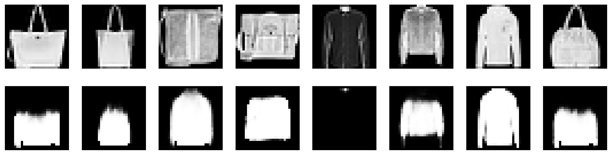

First Epoch:

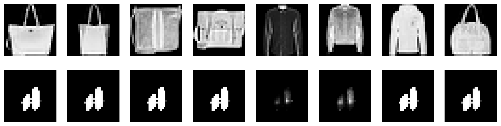

This shows how well the model evolved in reconstructing images. At the first epoch, reconstructions are blurry and look similar to each other, while at the best epoch, they are much sharper and more accurate.

```py
@torch.no_grad()
def show_reconstructions(model, loader, device, n=8, save_path=None):
    model.eval()
    x, _ = next(iter(loader))
    x = x[:n].to(device)
    logits, _, _ = model(x)
    xhat = torch.sigmoid(logits)
    x = x.cpu().numpy()
    xhat = xhat.cpu().numpy()
    fig, axes = plt.subplots(2, n, figsize=(n * 2, 4))
    for i in range(n):
        axes[0, i].imshow(x[i, 0], cmap="gray")
        axes[0, i].axis("off")
        axes[1, i].imshow(xhat[i, 0], cmap="gray")
        axes[1, i].axis("off")
    axes[0,0].set_ylabel("Input", fontsize=16)
    axes[1,0].set_ylabel("Reconstruction", fontsize=16)
    if save_path:
        plt.savefig(save_path, bbox_inches="tight", dpi=200)
    plt.show()
```

### 2. Prior Samples (unconditioned generation)

Best Epoch:

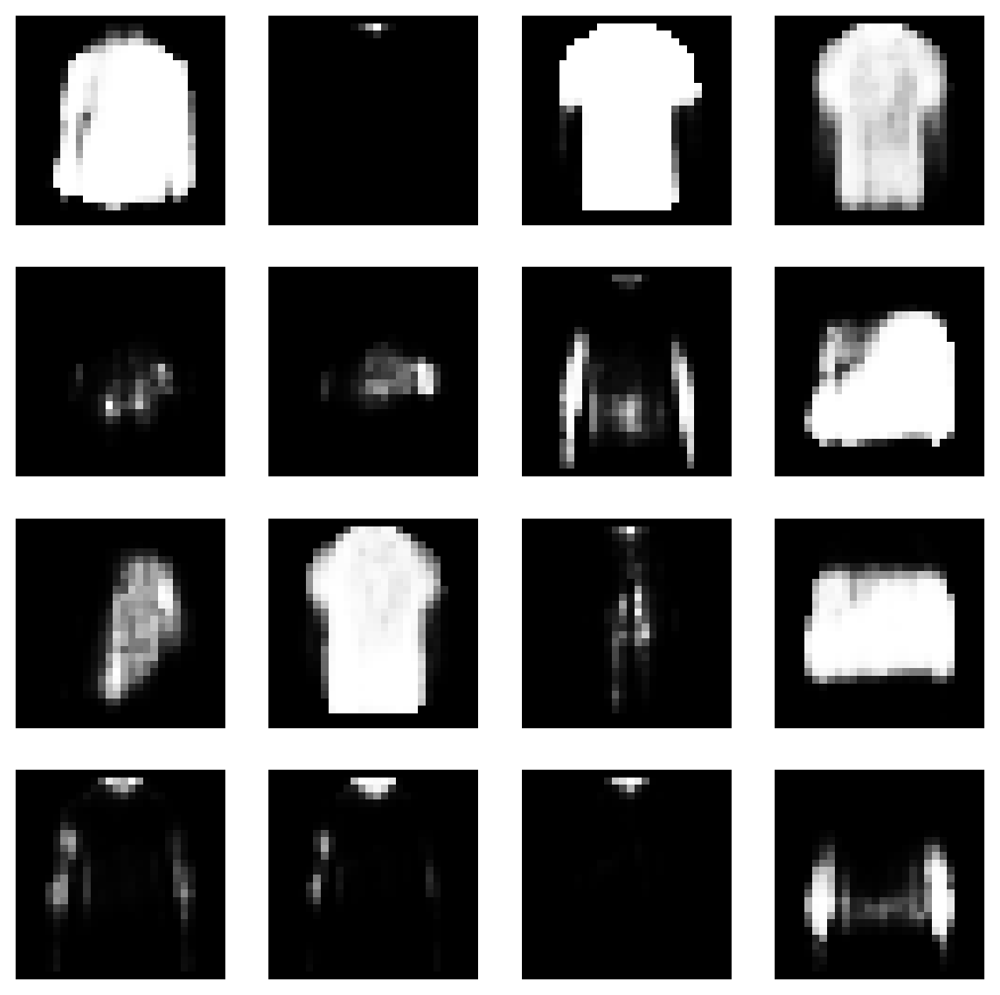

First Epoch:

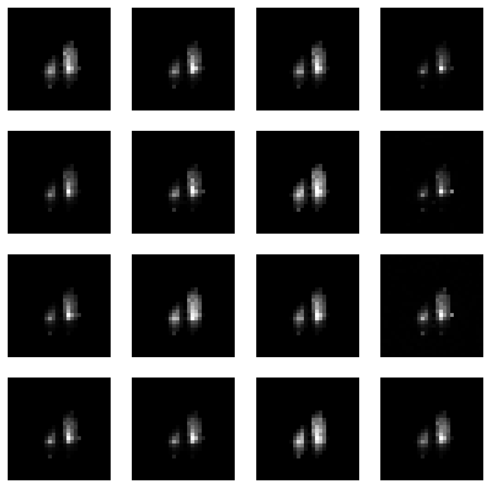

This shows samples generated from the prior distribution. At the first epoch, samples are mostly noise, while at the best epoch, they resemble realistic clothing items.

```py
@torch.no_grad()
def show_prior_samples(model, device, n=16, save_path=None):
    model.eval()
    z = torch.randn(n, model.latent_dim).to(device)
    logits = model.decode(z)
    xhat = torch.sigmoid(logits).cpu().numpy()
    cols = int(n**0.5)
    rows = (n + cols - 1) // cols
    fig, axes = plt.subplots(rows, cols, figsize=(cols * 2, rows * 2))
    axes = axes.ravel()
    for i in range(n):
        axes[i].imshow(xhat[i, 0], cmap="gray")
        axes[i].axis("off")
    if save_path:
        plt.savefig(save_path, bbox_inches="tight", dpi=200)
    plt.show()
```

### 3. Latent Space Scatter (2D projection of latent codes)

Best Epoch (t-SNE):

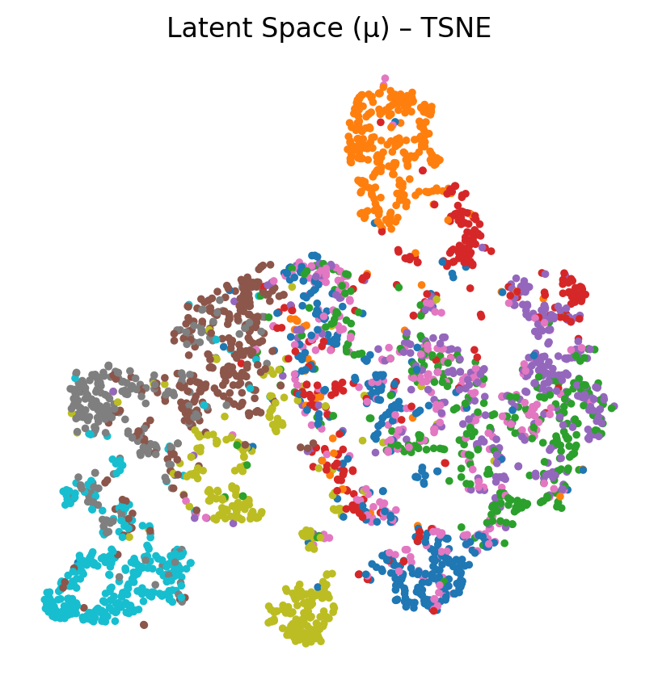

First Epoch (t-SNE):

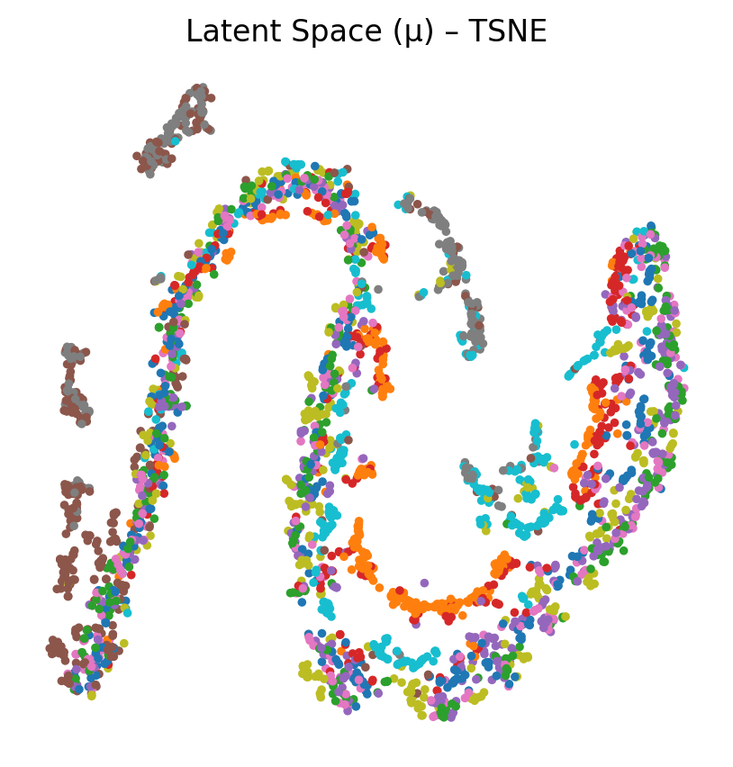

Best Epoch (PCA):

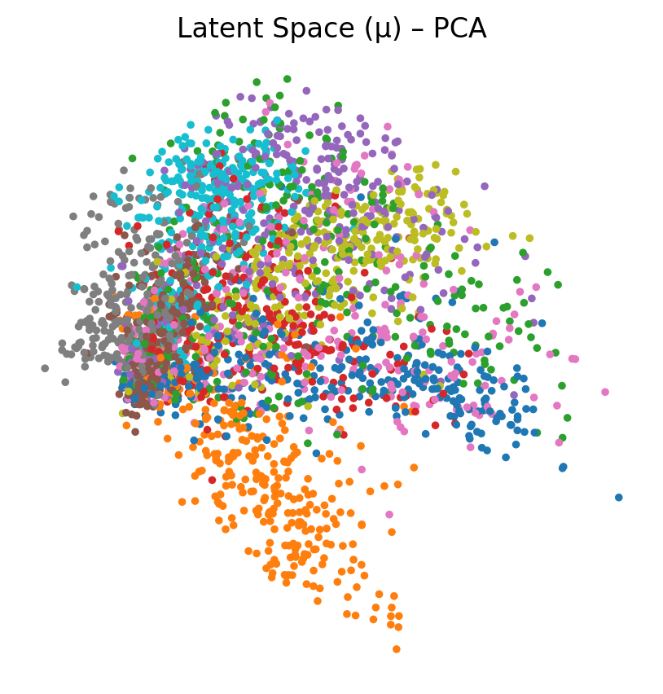

First Epoch (PCA):

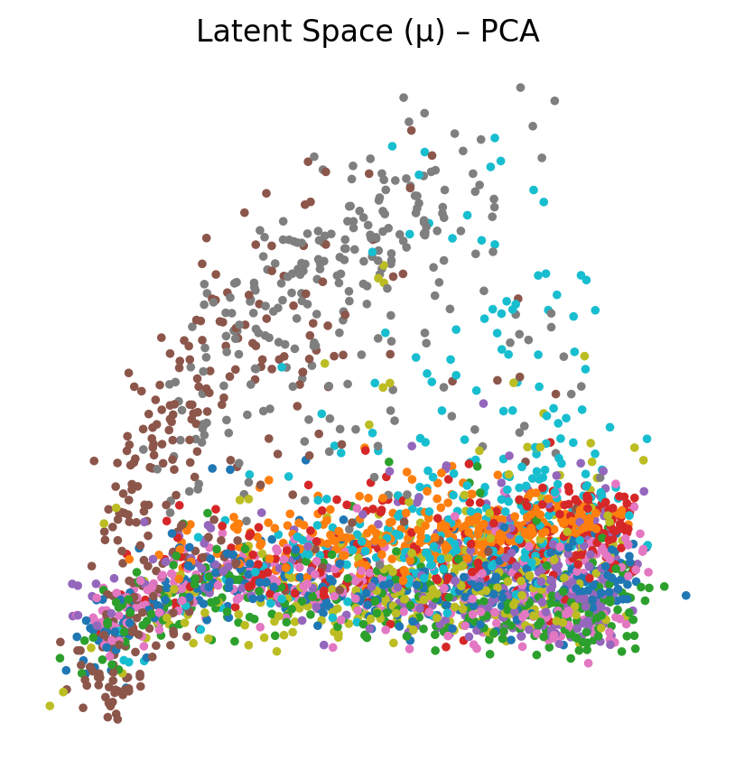

This projection shows how the latent space is organized. At the first epoch, points are clustered together without clear separation, while at the best epoch, some distinct clusters emerge corresponding to different clothing categories.

```py
@torch.no_grad()
def latent_scatter(model, loader, device, n=3000, method="pca", save_path=None):
    model.eval()
    Xs, Ys = [], []
    seen = 0
    for x, y in loader:
        x = x.to(device)
        _, mu, _ = model(x)
        Xs.append(mu.cpu())
        Ys.append(y)
        seen += x.size(0)
        if seen >= n: break

    Z = torch.cat(Xs, dim=0)[:n].numpy()
    Y = torch.cat(Ys, dim=0)[:n].numpy()

    if method == "tsne":
        try:
            Z2 = TSNE(n_components=2, init="pca", learning_rate="auto").fit_transform(Z)
        except Exception:
            method = "pca"
    if method == "pca":
        Zt = torch.from_numpy(Z)
        Zt = Zt - Zt.mean(0, keepdim=True)
        U, S, V = torch.pca_lowrank(Zt, q=2)
        Z2 = (Zt @ V[:, :2]).numpy()

    plt.figure(figsize=(5,5))
    plt.scatter(Z2[:,0], Z2[:,1], c=Y, s=6, cmap="tab10")
    plt.axis("off")
    plt.title("Latent Space (μ) – " + method.upper())
    if save_path: 
        plt.savefig(save_path, bbox_inches="tight", dpi=200)
    plt.show()
```

### 4. Latent Space Interpolation

Best Epoch:

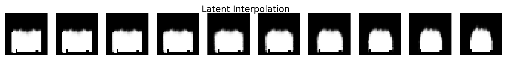

First Epoch:

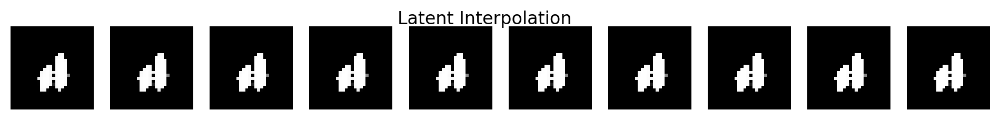

The linear interpolation between validation images.

```py
@torch.no_grad()
def interpolate_between(model, loader, device, steps=10, save_path=None):
    model.eval()
    x, y = next(iter(loader))
    a, b = x[0:1].to(device), x[1:2].to(device)
    mu_a, _ = model.encode(a)
    mu_b, _ = model.encode(b)
    alphas = torch.linspace(0, 1, steps, device=device).unsqueeze(1)
    z = (1 - alphas) * mu_a + alphas * mu_b
    logits = model.decode(z)
    imgs = torch.sigmoid(logits).cpu().numpy()
    fig, axes = plt.subplots(1, steps, figsize=(steps*1.2, 1.2))
    for i in range(steps):
        axes[i].imshow(imgs[i, 0], cmap="gray")
        axes[i].axis("off")
    fig.suptitle("Latent Interpolation", y=0.95)
    if save_path: 
        plt.savefig(save_path, bbox_inches="tight", dpi=200)
    plt.show()
```

### Latent Traversals

Best Epoch:

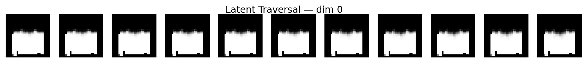

First Epoch:

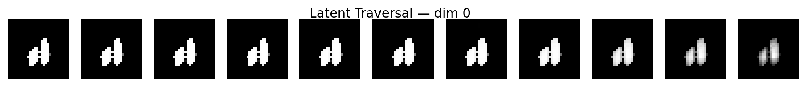

This shows how varying individual latent dimensions affects the generated images. At the first epoch, changes are minimal and noisy, while at the best epoch, distinct features like sleeve length and clothing type emerge.

```py
@torch.no_grad()
def latent_traversal(model, loader, device, dim=0, span=3.0, steps=11, save_path=None):
    model.eval()
    x, _ = next(iter(loader))
    x0 = x[0:1].to(device)
    mu, _ = model.encode(x0)
    z = mu.repeat(steps, 1)
    alphas = torch.linspace(-span, span, steps, device=device)
    z[:, dim] = alphas
    logits = model.decode(z)
    imgs = torch.sigmoid(logits).cpu().numpy()
    fig, axes = plt.subplots(1, steps, figsize=(steps*1.2, 1.2))
    for i in range(steps):
        axes[i].imshow(imgs[i, 0], cmap="gray")
        axes[i].axis("off")
    fig.suptitle(f"Latent Traversal — dim {dim}", y=0.95)
    if save_path: 
        plt.savefig(save_path, bbox_inches="tight", dpi=200)
    plt.show()
```

### Qualitative Summary

The reconstructions sharpen over training, and prior samples become more coherent and diverse. The scatter plots show clearer class separation at the best epoch, indicating more structured latent representations. The interpolations are smoother and more meaningful, and the latent traversals reveal interpretable changes in the generated images.

## Conclusion

In this exercise we implemented a Variational Autoencoder from scratch using Pytorch, trained it on the Fashion MNIST dataset, and evaluated its performance both quantitatively and qualitatively.

### Summary of Findings

Throughout training, the model gradually improved both reconstruction quality and latent space organization. The quantitative metrics show that images became sharper and faithful to the inputs, the KL divergence shows that latent variables were effectively utilized, and the BPD indicates efficient compression.

Visually, reconstructions evolved from blurry and homogeneus to distinct and more detailed. Latent projections revealed emerging clusters by clothing type, confirming the model learned meaningful representations. Interpolations and traversals demonstrated smooth transitions and interpretable features, indicating a well-structured latent space.

### Challenges and Insights

Training the VAE was challenging due to issues like loss scaling and posterior collapse. We mitigated this by using the methods described in the Training section, which stabilized learning and encouraged effective use of latent variables. 

**Key Insights**:

* A properly tuned beta scheduler is crucial for preventing collapse and encouraging a useful latent space.

* Even a simple fully connected VAE without convolutions can capture useful and interpretable representations when trained carefully.

* The learned latent space is smooth and continuous, enabling interpolation and controlled image variation. 

---

*Note*: Artificial intelligence was used in this exercise for code completion and review, for translating math formulas to Latex, and for text review.